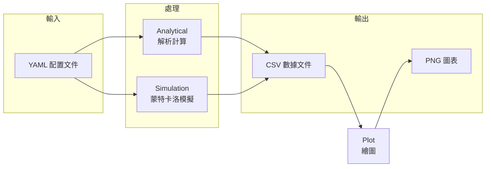
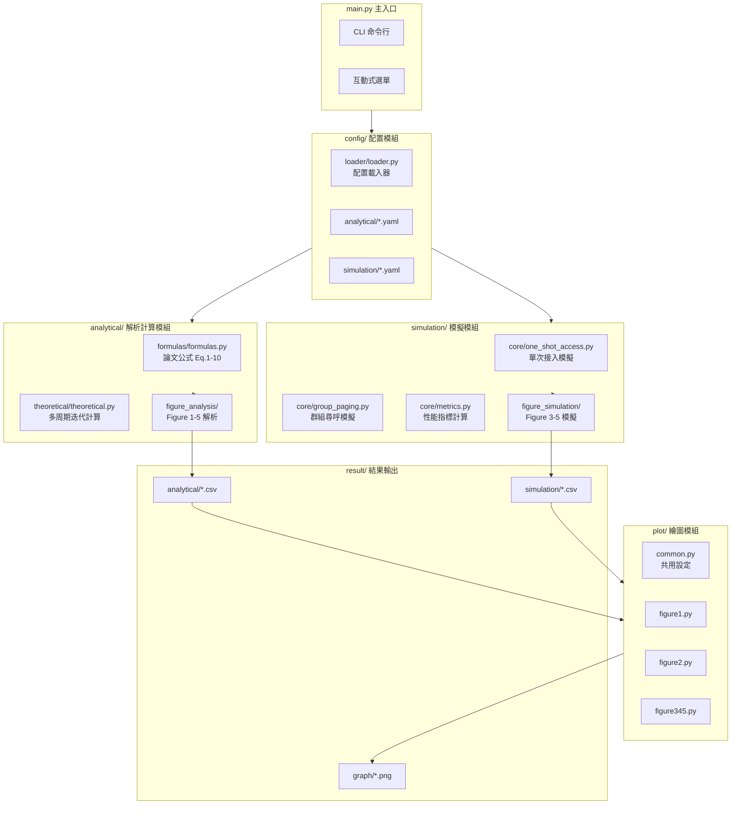
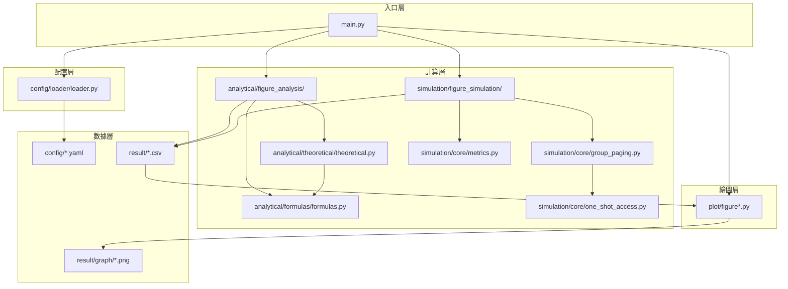
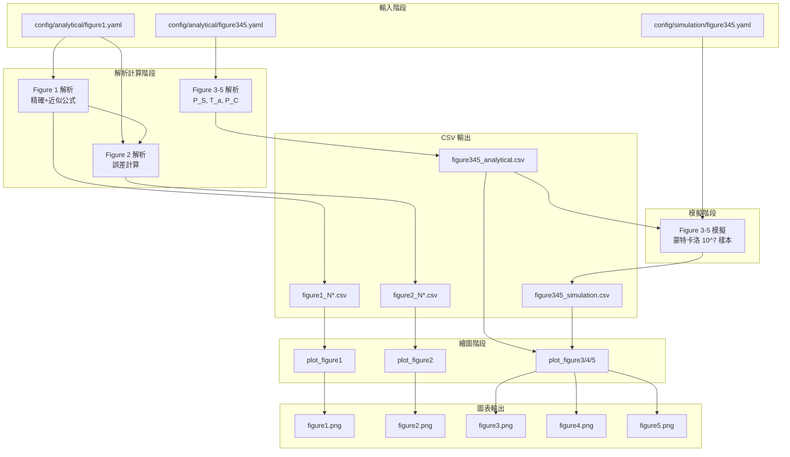
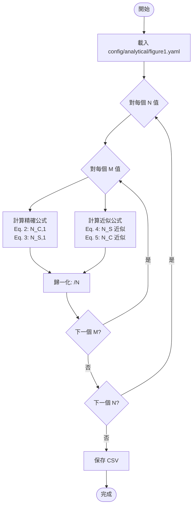
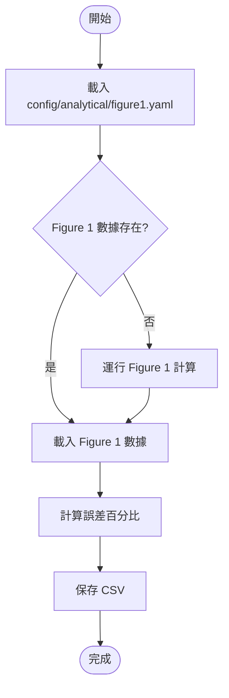
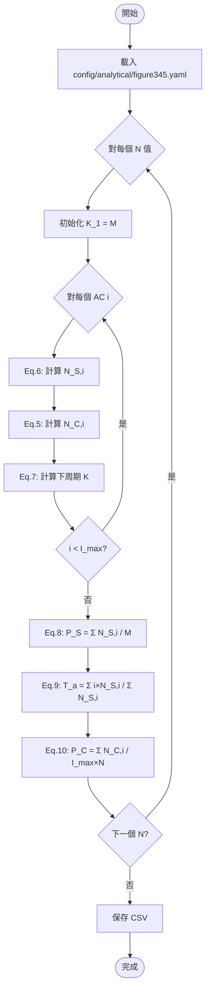
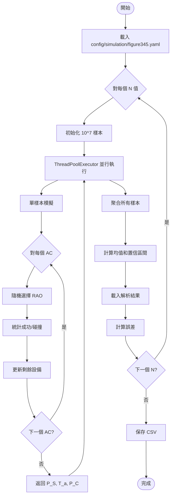
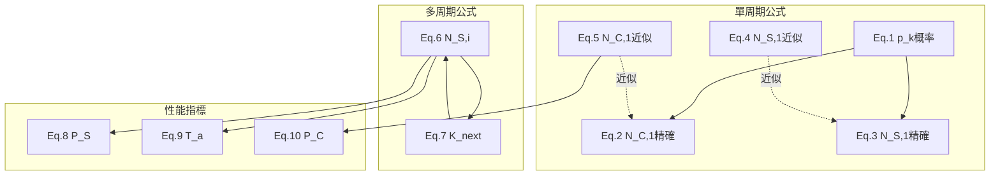

# One-Shot Random Access 模擬與分析系統

**版本**: 2.0.0 | **語言**: Python 3.14 (freethreaded) | **授權**: MIT License

---

## 📖 目錄

1. [項目簡介](#-項目簡介)
2. [論文背景](#-論文背景)
3. [系統架構總覽](#-系統架構總覽)
4. [核心概念與術語](#-核心概念與術語)
5. [快速開始](#-快速開始)
6. [項目結構](#-項目結構)
7. [數據流詳解](#-數據流詳解)
8. [功能選項完整說明](#-功能選項完整說明)
9. [論文公式對應](#-論文公式對應)
10. [配置文件詳解](#-配置文件詳解)
11. [輸出結果說明](#-輸出結果說明)
12. [開發指南](#-開發指南)
13. [常見問題 FAQ](#-常見問題-faq)

---

## 🎯 項目簡介

### 這個項目是什麼？

這是一個**論文復現項目**，用於模擬和分析多信道時隙 ALOHA 系統中的單次隨機接入（One-Shot Random Access）行為。

**簡單來說**：

- 📱 想像有 100 台設備（手機、IoT 設備等）同時想要連接到一個基站
- 📡 基站提供了 N 個「接入通道」（稱為 RAO）
- 🎲 每台設備隨機選擇一個通道嘗試接入
- ✅ 如果一個通道只有一台設備選擇 → **成功接入**
- ❌ 如果多台設備選擇同一通道 → **碰撞**，需要重試
- 🔄 這個過程最多重複 I_max 次

**這個系統做什麼？**

1. **理論計算**：使用論文公式計算預期的成功率、延遲、碰撞率
2. **蒙特卡洛模擬**：用大量隨機實驗驗證理論計算的準確性
3. **結果可視化**：生成論文中的 5 張圖表

### 項目的三大功能模組



---

## 📚 論文背景

### 論文信息

- **標題**: Modeling and Estimation of One-Shot Random Access for Finite-User Multichannel Slotted ALOHA Systems
- **作者**: Chia-Hung Wei, Ray-Guang Cheng, Shiao-Li Tsao
- **關鍵詞**: 機器類型通信（MTC）、群組尋呼（Group Paging）、隨機接入

### 研究問題

在 3GPP LTE 網絡中，當大量 MTC 設備（如智慧電表、傳感器）同時被激活時，會導致：

- 🚨 網絡擁塞
- ⏰ 接入延遲增加
- 📉 傳輸成功率下降

### 論文解決方案

提出了一套**數學模型**來預測：

- **P_S** (Access Success Probability)：設備成功接入的概率
- **T_a** (Mean Access Delay)：平均接入延遲（以接入周期為單位）
- **P_C** (Collision Probability)：RAO 發生碰撞的概率

### 本項目復現的圖表

| 圖表     | 內容                       | X 軸 | Y 軸               |
| -------- | -------------------------- | ---- | ------------------ |
| Figure 1 | 單周期精確公式 vs 近似公式 | M/N  | N_S,1/N 和 N_C,1/N |
| Figure 2 | 近似公式的誤差分析         | M/N  | 誤差百分比 (%)     |
| Figure 3 | 接入成功概率               | N    | P_S                |
| Figure 4 | 平均接入延遲               | N    | T_a                |
| Figure 5 | 碰撞概率                   | N    | P_C                |

---

## 🏗️ 系統架構總覽

### 整體架構圖



### 模組職責說明

| 模組            | 職責                      | 輸入          | 輸出        |
| --------------- | ------------------------- | ------------- | ----------- |
| **config/**     | 載入和管理 YAML 配置      | YAML 文件路徑 | Python 字典 |
| **analytical/** | 論文公式計算（精確+近似） | 配置參數      | CSV 文件    |
| **simulation/** | 蒙特卡洛隨機模擬          | 配置參數      | CSV 文件    |
| **plot/**       | 讀取 CSV 並繪製圖表       | CSV 文件      | PNG 圖片    |

---

## 📝 核心概念與術語

### 系統參數

| 符號      | 名稱                | 說明                          | 典型值  |
| --------- | ------------------- | ----------------------------- | ------- |
| **M**     | 設備總數            | 嘗試接入的設備數量            | 100     |
| **N**     | RAO 數量            | 每個接入周期的隨機接入機會數  | 5-45    |
| **I_max** | 最大周期數          | 設備最多嘗試的接入周期數      | 10      |
| **K_i**   | 第 i 周期競爭設備數 | 在第 i 個周期嘗試接入的設備數 | K_1 = M |

### 關鍵概念

#### RAO (Random Access Opportunity)

- **中文**: 隨機接入機會
- **解釋**: 基站在每個接入周期提供的「通道」，設備隨機選擇一個 RAO 發送接入請求
- **類比**: 就像超市的 N 個收銀台，每個顧客隨機選擇一個排隊

#### AC (Access Cycle)

- **中文**: 接入周期
- **解釋**: 一次完整的接入嘗試過程，失敗的設備會在下一個 AC 重試
- **類比**: 就像抽獎的「一輪」，沒中獎的下一輪再抽

#### 接入結果分類

```
┌─────────────────────────────────────────────────────┐
│                    一個接入周期                      │
├─────────────────────────────────────────────────────┤
│  RAO 1: 設備 A          → 成功 (只有 1 個設備)      │
│  RAO 2: 設備 B, C, D    → 碰撞 (多個設備)          │
│  RAO 3: 無設備          → 空閒                     │
│  RAO 4: 設備 E          → 成功                     │
│  RAO 5: 設備 F, G       → 碰撞                     │
├─────────────────────────────────────────────────────┤
│  N_S = 2 (成功 RAO 數)                              │
│  N_C = 2 (碰撞 RAO 數)                              │
│  N_I = 1 (空閒 RAO 數)                              │
└─────────────────────────────────────────────────────┘
```

### 性能指標

| 指標    | 公式                   | 意義                     |
| ------- | ---------------------- | ------------------------ |
| **P_S** | Σ N_S,i / M            | 設備成功接入的比例       |
| **T_a** | Σ(i × N_S,i) / Σ N_S,i | 成功設備的平均等待周期數 |
| **P_C** | Σ N_C,i / (I_max × N)  | RAO 發生碰撞的比例       |

---

## 🚀 快速開始

### Step 1: 環境要求

| 要求         | 版本                    | 說明                                                   |
| ------------ | ----------------------- | ------------------------------------------------------ |
| **Python**   | 3.14+ (freethreaded)    | **必須**使用 freethreaded 版本，以支持真正的多線程並行 |
| **包管理器** | uv (推薦) 或 pip        | uv 更快更現代                                          |
| **操作系統** | Windows / macOS / Linux | 全平台支持                                             |

#### 為什麼需要 Python 3.14 freethreaded？

模擬模組使用 `ThreadPoolExecutor` 進行多線程並行計算。在標準 Python 中，GIL（全局解釋器鎖）會阻止真正的並行執行。Python 3.14 freethreaded 版本移除了 GIL，可以實現：

- 🚀 真正的多核並行
- ⏱️ ~70,000 樣本/秒的吞吐量
- 💪 10^7 樣本只需 ~2.5 分鐘

### Step 2: 安裝依賴

```bash
# 克隆項目
git clone <repository-url>
cd FYP-1-One-Shot-Random-Access-New-Architecture

# 使用 uv 安裝依賴（推薦）
uv sync

# 或使用 pip
pip install numpy==2.3.5 matplotlib==3.10.7 tqdm==4.67.1 pyyaml==6.0.3
```

### Step 3: 運行系統

#### 方式一：互動式選單（推薦新手）

```bash
uv run python main.py
```

將看到以下選單：

```
======================================================================
One-Shot Random Access 模擬與分析系統
======================================================================

請選擇操作:

【解析計算 (Analytical)】
   1. Figure 1: NS,1/N & NC,1/N 精確公式 + 近似公式
   2. Figure 2: 近似誤差分析（精確 vs 近似）
   3. Figure 3, 4, 5 合併解析 (P_S, T_a, P_C)
   4. 運行所有解析計算

【模擬 (Simulation)】
   5. Figure 3, 4, 5 合併模擬 (P_S, T_a, P_C)

【繪圖 (Plot)】
   6. 繪製 Figure 1
   7. 繪製 Figure 2
   8. 繪製 Figure 3, 4, 5
   9. 繪製所有圖表

【完整流程】
  10. Figure 1 完整流程 (Analytical + Plot)
  11. Figure 2 完整流程 (Analytical + Plot)
  12. Figure 3, 4, 5 完整流程 (Analytical + Simulation + Plot)
  13. 所有圖表完整流程

   0. 退出
======================================================================
```

#### 方式二：CLI 命令行

```bash
# 解析計算
uv run python main.py analytical figure1        # Figure 1 解析
uv run python main.py analytical figure2        # Figure 2 解析
uv run python main.py analytical figure345      # Figure 3-5 解析
uv run python main.py analytical all            # 所有解析

# 模擬
uv run python main.py simulation figure345      # Figure 3-5 模擬

# 繪圖
uv run python main.py plot figure1              # 繪製 Figure 1
uv run python main.py plot figure2              # 繪製 Figure 2
uv run python main.py plot figure345            # 繪製 Figure 3-5
uv run python main.py plot all                  # 繪製所有

# 完整流程
uv run python main.py run figure1               # Figure 1 完整
uv run python main.py run figure2               # Figure 2 完整
uv run python main.py run figure345             # Figure 3-5 完整
uv run python main.py run all                   # 所有完整
```

### Step 4: 推薦的首次運行

**對於新手**，建議按以下順序執行：

```bash
# 1. 先運行 Figure 1 完整流程（最快，約 1-2 分鐘）
uv run python main.py run figure1

# 2. 查看生成的圖表
# 輸出位置: result/graph/figure1/{時間戳}/figure1.png

# 3. 如果想體驗完整功能，運行 Figure 3-5（較慢，模擬約 2-3 分鐘/N值）
uv run python main.py run figure345
```

---

## 📁 項目結構

### 完整目錄樹

```
FYP-1-One-Shot-Random-Access-New-Architecture/
│
├── main.py                        # 🎯 主程式入口 (541 行)
│                                  #    - interactive_menu(): 互動式選單
│                                  #    - CLI 命令解析
│                                  #    - 13 個功能選項的調用入口
│
├── pyproject.toml                 # 📦 項目配置與依賴管理
├── uv.lock                        # 🔒 依賴版本鎖定
├── .python-version                # 🐍 Python 版本指定 (3.14)
├── README.md                      # 📖 本文檔
│
├── config/                        # ⚙️ 配置文件模組
│   ├── __init__.py               #    導出 load_config 等函數
│   ├── README.md                 #    模組說明
│   │
│   ├── loader/                   #    配置載入器子模組
│   │   ├── __init__.py
│   │   ├── loader.py             #    load_config(), get_config_path()
│   │   └── README.md
│   │
│   ├── analytical/               #    解析計算配置
│   │   ├── figure1.yaml          #    Figure 1 & 2 配置
│   │   ├── figure345.yaml        #    Figure 3-5 配置
│   │   └── README.md
│   │
│   └── simulation/               #    模擬配置
│       ├── figure345.yaml        #    Figure 3-5 模擬配置
│       ├── single_point.yaml     #    單點測試配置
│       └── README.md
│
├── analytical/                    # 📐 解析計算模組
│   ├── __init__.py               #    導出所有公式函數
│   ├── README.md                 #    模組說明
│   │
│   ├── formulas/                 #    論文公式實現
│   │   ├── __init__.py
│   │   ├── formulas.py           #    Eq. 1-10 所有公式 (257 行)
│   │   └── README.md
│   │
│   ├── theoretical/              #    理論計算
│   │   ├── __init__.py
│   │   ├── theoretical.py        #    多周期迭代計算 (58 行)
│   │   └── README.md
│   │
│   └── figure_analysis/          #    各圖表解析計算
│       ├── __init__.py
│       ├── figure1_analysis.py   #    Figure 1 計算 (244 行)
│       ├── figure2_analysis.py   #    Figure 2 誤差計算 (203 行)
│       ├── figure345_analysis.py #    Figure 3-5 計算 (163 行)
│       └── README.md
│
├── simulation/                    # 🔬 模擬模組
│   ├── __init__.py               #    導出模擬函數
│   ├── README.md                 #    模組說明
│   │
│   ├── core/                     #    核心模擬引擎
│   │   ├── __init__.py
│   │   ├── one_shot_access.py    #    單次接入模擬 (29 行)
│   │   ├── group_paging.py       #    群組尋呼模擬 (259 行)
│   │   ├── metrics.py            #    性能指標計算 (39 行)
│   │   └── README.md
│   │
│   └── figure_simulation/        #    圖表模擬
│       ├── __init__.py
│       ├── figure345_simulation.py  # Figure 3-5 模擬 (288 行)
│       └── README.md
│
├── plot/                          # 📊 繪圖模組
│   ├── __init__.py               #    導出繪圖函數
│   ├── README.md                 #    模組說明
│   ├── common.py                 #    共用設定 (matplotlib 配置)
│   ├── figure1.py                #    Figure 1 繪圖 (195 行)
│   ├── figure2.py                #    Figure 2 繪圖 (161 行)
│   └── figure345.py              #    Figure 3-5 繪圖 (310 行)
│
├── performance/                   # 📊 性能監測模組
│   ├── __init__.py               #    導出性能監測函數
│   ├── README.md                 #    模組說明
│   ├── performance_monitor.py    #    核心監測裝飾器和數據收集器
│   └── performance_report.py     #    報告生成和數據保存
│
├── result/                        # 📁 結果輸出 (運行時自動創建)
│   ├── analytical/               #    解析結果
│   │   ├── figure1/{timestamp}/  #    figure1_N3.csv, figure1_N14.csv
│   │   ├── figure2/{timestamp}/  #    figure2_N3.csv, figure2_N14.csv
│   │   └── figure345/{timestamp}/#    figure345_analytical.csv
│   │
│   ├── simulation/               #    模擬結果
│   │   └── figure345/{timestamp}/#    figure345_simulation.csv
│   │
│   ├── graph/                    #    圖表輸出
│   │   ├── figure1/{timestamp}/  #    figure1.png
│   │   ├── figure2/{timestamp}/  #    figure2.png
│   │   ├── figure3/{timestamp}/  #    figure3.png
│   │   ├── figure4/{timestamp}/  #    figure4.png
│   │   └── figure5/{timestamp}/  #    figure5.png
│   │
│   └── performance/              #    性能報告輸出
│       └── {timestamp}/          #    performance_data.json
│
├── docs/                          # 📚 文檔
│   ├── FYP-Paper-1.pdf           #    論文 PDF
│   └── Paper.md                  #    論文筆記
│
└── workflow/                      # 🔄 工作流程文檔
    └── main_workflow.md          #    完整執行流程（含 Mermaid 圖）
```

### 各模組功能詳細說明

#### 1. config/ 模組

| 文件                        | 功能                | 主要函數/內容                               |
| --------------------------- | ------------------- | ------------------------------------------- |
| `loader/loader.py`          | 配置載入器          | `load_config(type, name)` - 載入 YAML 配置  |
| `analytical/figure1.yaml`   | Figure 1&2 配置     | n_values, m_over_n_max, m_start, n_jobs     |
| `analytical/figure345.yaml` | Figure 3-5 解析配置 | M, I_max, N_start, N_stop, N_step           |
| `simulation/figure345.yaml` | Figure 3-5 模擬配置 | M, I_max, N range, num_samples, num_workers |

#### 2. analytical/ 模組

| 文件                                    | 功能             | 輸入              | 輸出                    |
| --------------------------------------- | ---------------- | ----------------- | ----------------------- |
| `formulas/formulas.py`                  | 論文公式 Eq.1-10 | M, N, 參數        | 計算結果                |
| `theoretical/theoretical.py`            | 多周期迭代       | M, N, I_max       | P_S, T_a, P_C, N_s_list |
| `figure_analysis/figure1_analysis.py`   | Figure 1 計算    | config            | CSV 文件                |
| `figure_analysis/figure2_analysis.py`   | Figure 2 誤差    | config, fig1_data | CSV 文件                |
| `figure_analysis/figure345_analysis.py` | Figure 3-5 解析  | config            | CSV 文件                |

#### 3. simulation/ 模組

| 文件                                        | 功能            | 輸入          | 輸出                     |
| ------------------------------------------- | --------------- | ------------- | ------------------------ |
| `core/one_shot_access.py`                   | 單 AC 模擬      | M, N          | success, collision, idle |
| `core/group_paging.py`                      | 多 AC 模擬      | M, N, I_max   | P_S, T_a, P_C            |
| `core/metrics.py`                           | 統計計算        | results_array | mean, CI                 |
| `figure_simulation/figure345_simulation.py` | Figure 3-5 模擬 | config        | CSV 文件                 |

#### 4. plot/ 模組

| 文件           | 功能            | 輸入     | 輸出     |
| -------------- | --------------- | -------- | -------- |
| `common.py`    | matplotlib 配置 | -        | -        |
| `figure1.py`   | Figure 1 繪圖   | CSV 數據 | PNG 圖片 |
| `figure2.py`   | Figure 2 繪圖   | CSV 數據 | PNG 圖片 |
| `figure345.py` | Figure 3-5 繪圖 | CSV 數據 | PNG 圖片 |

### 模組依賴關係圖



---

## 🔄 數據流詳解

### 完整數據流圖



### 各階段輸入/輸出詳細說明

#### 階段 1: 配置載入

| 輸入                               | 處理                                     | 輸出        |
| ---------------------------------- | ---------------------------------------- | ----------- |
| `config/analytical/figure1.yaml`   | `load_config('analytical', 'figure1')`   | Python dict |
| `config/analytical/figure345.yaml` | `load_config('analytical', 'figure345')` | Python dict |
| `config/simulation/figure345.yaml` | `load_config('simulation', 'figure345')` | Python dict |

#### 階段 2: 解析計算

| 選項       | 輸入                    | 處理函數                   | 輸出                                                        |
| ---------- | ----------------------- | -------------------------- | ----------------------------------------------------------- |
| Figure 1   | config dict             | `run_figure1_analysis()`   | `result/analytical/figure1/{ts}/figure1_N*.csv`             |
| Figure 2   | config dict + fig1_data | `run_figure2_analysis()`   | `result/analytical/figure2/{ts}/figure2_N*.csv`             |
| Figure 3-5 | config dict             | `run_figure345_analysis()` | `result/analytical/figure345/{ts}/figure345_analytical.csv` |

#### 階段 3: 模擬計算

| 選項       | 輸入        | 處理函數                     | 輸出                                                        |
| ---------- | ----------- | ---------------------------- | ----------------------------------------------------------- |
| Figure 3-5 | config dict | `run_figure345_simulation()` | `result/simulation/figure345/{ts}/figure345_simulation.csv` |

#### 階段 4: 繪圖

| 選項     | 輸入 CSV        | 處理函數         | 輸出 PNG    |
| -------- | --------------- | ---------------- | ----------- |
| Figure 1 | figure1_N*.csv  | `plot_figure1()` | figure1.png |
| Figure 2 | figure2_N*.csv  | `plot_figure2()` | figure2.png |
| Figure 3 | figure345_*.csv | `plot_figure3()` | figure3.png |
| Figure 4 | figure345_*.csv | `plot_figure4()` | figure4.png |
| Figure 5 | figure345_*.csv | `plot_figure5()` | figure5.png |

---

## 📋 功能選項完整說明

### 選項總覽

| 選項 | 類型 | 功能                   | 耗時          | 依賴           |
| ---- | ---- | ---------------------- | ------------- | -------------- |
| 1    | 解析 | Figure 1 精確+近似公式 | ~1-2 分鐘     | 無             |
| 2    | 解析 | Figure 2 誤差分析      | ~1-2 分鐘     | 選項 1         |
| 3    | 解析 | Figure 3-5 解析        | ~5 秒         | 無             |
| 4    | 解析 | 運行所有解析           | ~2-4 分鐘     | 無             |
| 5    | 模擬 | Figure 3-5 模擬        | ~100-120 分鐘 | 選項 3（可選） |
| 6    | 繪圖 | 繪製 Figure 1          | ~1 秒         | 選項 1         |
| 7    | 繪圖 | 繪製 Figure 2          | ~1 秒         | 選項 2         |
| 8    | 繪圖 | 繪製 Figure 3-5        | ~1 秒         | 選項 3, 5      |
| 9    | 繪圖 | 繪製所有圖表           | ~1 秒         | 選項 1-5       |
| 10   | 流程 | Figure 1 完整          | ~1-2 分鐘     | 無             |
| 11   | 流程 | Figure 2 完整          | ~1-2 分鐘     | 無             |
| 12   | 流程 | Figure 3-5 完整        | ~100-120 分鐘 | 無             |
| 13   | 流程 | 所有完整               | ~105-125 分鐘 | 無             |

---

### 【選項 1】Figure 1 解析計算

#### 功能說明

計算單個接入周期（One-Shot）的期望成功 RAO 數和碰撞 RAO 數：

- **精確公式**: 使用組合數學（Eq. 1-3）
- **近似公式**: 使用泊松近似（Eq. 4-5）

#### 執行流程



#### 輸入參數

| 參數         | 來源         | 說明       | 默認值    |
| ------------ | ------------ | ---------- | --------- |
| n_values     | figure1.yaml | N 值列表   | [3, 14]   |
| m_over_n_max | figure1.yaml | M/N 最大值 | 10        |
| m_start      | figure1.yaml | M 起始值   | 1         |
| n_jobs       | figure1.yaml | 並行核心數 | -1 (全部) |

#### 輸出文件

**路徑**: `result/analytical/figure1/{timestamp}/figure1_N{n}.csv`

| 欄位           | 類型  | 說明             |
| -------------- | ----- | ---------------- |
| M              | int   | 設備數           |
| M/N            | float | M/N 比值         |
| analytical_N_S | float | 精確公式 N_S,1/N |
| analytical_N_C | float | 精確公式 N_C,1/N |
| approx_N_S     | float | 近似公式 N_S,1/N |
| approx_N_C     | float | 近似公式 N_C,1/N |

#### 使用範例

```bash
# 互動式
uv run python main.py
# 輸入 1

# CLI
uv run python main.py analytical figure1
```

---

### 【選項 2】Figure 2 解析計算

#### 功能說明

計算近似公式相對於精確公式的誤差百分比：

```
誤差 = |精確值 - 近似值| / |精確值| × 100%
```

#### 執行流程



#### 輸入參數

與選項 1 相同（使用 figure1.yaml）

#### 輸出文件

**路徑**: `result/analytical/figure2/{timestamp}/figure2_N{n}.csv`

| 欄位           | 類型  | 說明             |
| -------------- | ----- | ---------------- |
| M              | int   | 設備數           |
| M/N            | float | M/N 比值         |
| analytical_N_S | float | 精確公式 N_S,1/N |
| analytical_N_C | float | 精確公式 N_C,1/N |
| approx_N_S     | float | 近似公式 N_S,1/N |
| approx_N_C     | float | 近似公式 N_C,1/N |
| N_S_error(%)   | float | N_S 誤差百分比   |
| N_C_error(%)   | float | N_C 誤差百分比   |

---

### 【選項 3】Figure 3, 4, 5 合併解析計算

#### 功能說明

使用多周期迭代公式（Eq. 6-10）計算三個性能指標：

- **P_S**: 接入成功概率
- **T_a**: 平均接入延遲
- **P_C**: 碰撞概率

#### 執行流程



#### 輸入參數

| 參數    | 來源           | 說明       | 默認值 |
| ------- | -------------- | ---------- | ------ |
| M       | figure345.yaml | 設備總數   | 100    |
| I_max   | figure345.yaml | 最大周期數 | 10     |
| N_start | figure345.yaml | N 起始值   | 5      |
| N_stop  | figure345.yaml | N 結束值   | 46     |
| N_step  | figure345.yaml | N 步長     | 1      |

#### 輸出文件

**路徑**: `result/analytical/figure345/{timestamp}/figure345_analytical.csv`

| 欄位  | 類型  | 說明         |
| ----- | ----- | ------------ |
| N     | int   | RAO 數量     |
| P_S   | float | 接入成功概率 |
| T_a   | float | 平均接入延遲 |
| P_C   | float | 碰撞概率     |
| M     | int   | 設備總數     |
| I_max | int   | 最大周期數   |

---

### 【選項 4】運行所有解析計算

依序執行選項 1 → 2 → 3，並優化數據傳遞避免重複計算。

---

### 【選項 5】Figure 3, 4, 5 合併模擬

#### 功能說明

使用蒙特卡洛模擬驗證理論公式：

- 執行 10^7 次隨機模擬
- 使用多線程並行加速
- 計算與理論值的誤差

#### 執行流程



#### 輸入參數

| 參數        | 來源           | 說明       | 默認值        |
| ----------- | -------------- | ---------- | ------------- |
| M           | figure345.yaml | 設備總數   | 100           |
| I_max       | figure345.yaml | 最大周期數 | 10            |
| N range     | figure345.yaml | N 範圍     | 5-45, 步長 1  |
| num_samples | figure345.yaml | 樣本數     | 10,000,000    |
| num_workers | figure345.yaml | 線程數     | -1 (全部核心) |

#### 輸出文件

**路徑**: `result/simulation/figure345/{timestamp}/figure345_simulation.csv`

| 欄位      | 類型  | 說明             |
| --------- | ----- | ---------------- |
| N         | int   | RAO 數量         |
| P_S       | float | 模擬接入成功概率 |
| T_a       | float | 模擬平均接入延遲 |
| P_C       | float | 模擬碰撞概率     |
| P_S_error | float | P_S 誤差百分比   |
| T_a_error | float | T_a 誤差百分比   |
| P_C_error | float | P_C 誤差百分比   |
| M         | int   | 設備總數         |
| I_max     | int   | 最大周期數       |

#### 性能說明

- **吞吐量**: ~70,000-74,000 樣本/秒
- **單個 N 值耗時**: ~140 秒
- **全部 41 個 N 值**: ~95-100 分鐘

---

### 【選項 6-9】繪圖選項

#### 選項 6: 繪製 Figure 1


**輸出**: 包含 4 個子圖的圖表

- (a) N=3 解析結果
- (b) N=14 解析結果
- (c) 近似公式結果
- (d) 全部合併

#### 選項 7: 繪製 Figure 2

**輸出**: 誤差分析圖（Y 軸對數刻度）

#### 選項 8: 繪製 Figure 3, 4, 5

**輸出**: 三張獨立圖表

- 左 Y 軸: 性能指標（藍色）
- 右 Y 軸: 近似誤差（綠色）
- 實線: 理論曲線
- 空心圓: 模擬結果

#### 選項 9: 繪製所有圖表

依序執行選項 6 → 7 → 8

---

### 【選項 10-13】完整流程

| 選項 | 流程                           |
| ---- | ------------------------------ |
| 10   | Figure 1: 解析 → 繪圖          |
| 11   | Figure 2: 解析 → 繪圖          |
| 12   | Figure 3-5: 解析 → 模擬 → 繪圖 |
| 13   | 全部: 選項 10 → 11 → 12        |

---

## 📐 論文公式對應

### 公式列表

| 公式  | 函數名                                       | 數學表達式                            | 用途            |
| ----- | -------------------------------------------- | ------------------------------------- | --------------- |
| Eq.1  | `paper_formula_1_pk_probability`             | P(k 個 RAO 碰撞)                      | 基礎概率        |
| Eq.2  | `paper_formula_2_collision_raos_exact`       | N_C,1 = Σ k × p_k                     | 精確碰撞 RAO 數 |
| Eq.3  | `paper_formula_3_success_raos_exact`         | N_S,1 = E[成功 RAO]                   | 精確成功 RAO 數 |
| Eq.4  | `paper_formula_4_success_approx`             | N_S,1 ≈ M × exp(-M/N)                 | 近似成功 RAO 數 |
| Eq.5  | `paper_formula_5_collision_approx`           | N_C,1 ≈ N × (1 - exp(-M/N) × (1+M/N)) | 近似碰撞 RAO 數 |
| Eq.6  | `paper_formula_6_success_per_cycle`          | N_S,i = K_i × exp(-K_i/N)             | 第 i 周期成功數 |
| Eq.7  | `paper_formula_7_next_contending_devices`    | K_next = K_i × (1 - exp(-K_i/N))      | 下周期競爭數    |
| Eq.8  | `paper_formula_8_access_success_probability` | P_S = Σ N_S,i / M                     | 接入成功概率    |
| Eq.9  | `paper_formula_9_mean_access_delay`          | T_a = Σ(i×N_S,i) / Σ N_S,i            | 平均延遲        |
| Eq.10 | `paper_formula_10_collision_probability`     | P_C = Σ N_C,i / (I_max × N)           | 碰撞概率        |

### 公式依賴關係圖



### 公式分類

| 分類     | 公式    | 使用場景               |
| -------- | ------- | ---------------------- |
| 精確公式 | Eq.1-3  | Figure 1（理論驗證）   |
| 近似公式 | Eq.4-5  | Figure 1-2（快速計算） |
| 迭代公式 | Eq.6-7  | Figure 3-5（多周期）   |
| 指標公式 | Eq.8-10 | Figure 3-5（性能評估） |

---

## ⚙️ 配置文件詳解

### figure1.yaml (Figure 1 & 2 共用)

```yaml
# N 值列表 - 論文使用 N=3 和 N=14
n_values: [3, 14]

# M/N 最大值 - 論文範圍 0 到 10
m_over_n_max: 10

# M 起始值 - 論文從 M=1 開始
m_start: 1

# 並行計算核心數
# -1: 使用所有 CPU 核心
# 正整數: 指定核心數
n_jobs: -1
```

**參數影響**:

- `n_values`: 決定生成幾組數據（每個 N 一個 CSV）
- `m_over_n_max`: 決定 M 的範圍（M 從 m_start 到 m_over_n_max × N）
- `n_jobs`: 影響計算速度

### figure345.yaml (解析配置)

```yaml
# 設備總數 - 論文使用 M=100
M: 100

# 最大接入周期數 - 論文使用 I_max=10
I_max: 10

# N 範圍設定 - 論文範圍 5 到 45
N_start: 5    # N 起始值
N_stop: 46    # N 結束值（不包含）
N_step: 1     # N 步長
```

**參數影響**:

- `M`: 設備總數，影響系統負載
- `I_max`: 最大重試次數，影響成功率
- `N_*`: 決定計算的 N 值範圍

### figure345.yaml (模擬配置)

```yaml
description: "Figure 3, 4, 5: Combined Simulation"

simulation:
  M: 100           # 設備總數
  I_max: 10        # 最大周期數

scan:
  parameter: N     # 掃描參數
  range:
    start: 5       # N 起始
    stop: 46       # N 結束
    step: 1        # N 步長

performance:
  num_samples: 10000000   # 樣本數 (10^7)
  num_workers: -1         # 線程數 (-1 = 全部)

output:
  save_csv: true   # 是否保存 CSV
```

**參數影響**:

- `num_samples`: 樣本數越多，結果越準確，但耗時越長
- `num_workers`: 線程數，建議使用 -1 自動檢測

### single_point.yaml (單點測試)

```yaml
description: "Single Point Detailed Simulation"

simulation:
  M: 100           # 設備總數
  N: 40            # 固定 N 值
  I_max: 10        # 最大周期數

performance:
  num_samples: 1000   # 少量樣本
  num_workers: 16     # 線程數

output:
  save_csv: true
  show_details: true  # 顯示詳細信息
```

**用途**: 快速測試和調試

---

## 📊 輸出結果說明

### CSV 文件格式

#### figure1_N{n}.csv

```csv
M,M/N,analytical_N_S,analytical_N_C,approx_N_S,approx_N_C
1,0.333,0.222,0.000,0.238,0.000
2,0.667,0.395,0.049,0.422,0.070
3,1.000,0.522,0.111,0.552,0.148
...
```

#### figure2_N{n}.csv

```csv
M,M/N,analytical_N_S,analytical_N_C,approx_N_S,approx_N_C,N_S_error(%),N_C_error(%)
1,0.333,0.222,0.000,0.238,0.000,7.23,0.00
2,0.667,0.395,0.049,0.422,0.070,6.84,42.86
...
```

#### figure345_analytical.csv

```csv
N,P_S,T_a,P_C,M,I_max
5,0.369,4.832,0.584,100,10
6,0.452,4.215,0.542,100,10
...
45,0.998,1.078,0.045,100,10
```

#### figure345_simulation.csv

```csv
N,P_S,T_a,P_C,P_S_error,T_a_error,P_C_error,M,I_max
5,0.368,4.831,0.583,0.27,0.02,0.17,100,10
6,0.451,4.213,0.541,0.22,0.05,0.18,100,10
...
```

### 圖表輸出說明

#### Figure 1: 精確 vs 近似

- **佈局**: 2 行，上面 3 個子圖，下面 1 個合併圖
- **線條樣式**:
  - N=3: 實線+圓圈（N_S）、點線+圓圈（N_C）
  - N=14: 實線無標記（N_S）、虛線無標記（N_C）
  - 近似: 細點線（N_S）、點劃線（N_C）

#### Figure 2: 誤差分析

- **Y 軸**: 對數刻度（1e-2 到 1e3）
- **線條**: 與 Figure 1 對應

#### Figure 3-5: 性能指標

- **雙 Y 軸**:
  - 左軸（藍色）: 性能指標值
  - 右軸（綠色）: 近似誤差 (%)
- **線條樣式**:
  - 實線: 理論曲線
  - 空心圓: 模擬結果
  - 虛線: 誤差曲線

### 結果目錄結構

```
result/
├── analytical/
│   ├── figure1/
│   │   └── 20260106_143022/
│   │       ├── figure1_N3.csv
│   │       └── figure1_N14.csv
│   ├── figure2/
│   │   └── 20260106_143025/
│   │       ├── figure2_N3.csv
│   │       └── figure2_N14.csv
│   └── figure345/
│       └── 20260106_143030/
│           └── figure345_analytical.csv
│
├── simulation/
│   └── figure345/
│       └── 20260106_153045/
│           └── figure345_simulation.csv
│
└── graph/
    ├── figure1/
    │   └── 20260106_143027/
    │       └── figure1.png
    ├── figure2/
    │   └── 20260106_143028/
    │       └── figure2.png
    ├── figure3/
    │   └── 20260106_153050/
    │       └── figure3.png
    ├── figure4/
    │   └── 20260106_153051/
    │       └── figure4.png
    └── figure5/
        └── 20260106_153052/
            └── figure5.png
```

---

## 🔧 開發指南

### 代碼結構原則

1. **模組解耦**: Analytical、Simulation、Plot 三模組獨立運作
2. **數據傳遞**: 通過 CSV 文件，不依賴內存
3. **配置驅動**: 所有參數由 YAML 文件控制

### 文檔維護要求

**重要**: 任何功能更新必須同步更新文檔

#### 文件夾文檔

每個文件夾需要 README.md，包含：

- 文件夾功能（3 行以內）
- 文件列表及功能說明

#### 文件註釋

每個 Python 文件開頭需要：

- **Input**: 依賴的外部模組/數據
- **Output**: 對外提供的函數/類
- **Position**: 在系統中的角色

### 添加新 Figure 的步驟

1. **配置**: 在 `config/` 添加 YAML 文件
2. **計算**: 在 `analytical/figure_analysis/` 或 `simulation/figure_simulation/` 添加計算邏輯
3. **繪圖**: 在 `plot/` 添加繪圖函數
4. **入口**: 在 `main.py` 添加選單和處理邏輯
5. **文檔**: 更新 README 和相關文檔

### 工作流程文檔

詳細的執行流程請參考 [`workflow/main_workflow.md`](workflow/main_workflow.md)

---

## 📊 性能監測

### 功能概述

系統內置性能監測功能，可測量所有關鍵函數的：
- **執行時間**: 精確到毫秒
- **內存使用**: 峰值和增量（MB）
- **CPU 使用率**: 平均和峰值（%）

### 快速使用

#### CLI 模式

```bash
# 啟用性能監測運行 Figure 1
uv run python main.py run figure1 --performance

# 啟用性能監測運行完整流程
uv run python main.py run all --performance

# 指定報告保存路徑
uv run python main.py run figure345 --performance --performance-report ./my_reports
```

#### 程序化使用

```python
from performance import performance_monitor, start_monitoring, stop_monitoring, generate_performance_report

# 方式 1: 使用裝飾器
@performance_monitor(level='workflow', name='My Workflow')
def my_function():
    pass

# 方式 2: 手動控制
start_monitoring()
# ... 執行代碼 ...
stop_monitoring()
generate_performance_report()
```

### 監測級別

| 級別       | 說明       | 適用場景         |
| ---------- | ---------- | ---------------- |
| `function` | 函數級別   | 細粒度分析       |
| `module`   | 模組級別   | 分析模組整體性能 |
| `workflow` | 工作流級別 | 分析完整流程     |

### 輸出

運行後自動生成：
- **控制台報告**:
  - 執行摘要（時間/內存/CPU）
  - 各級別時間分布
  - Top 10 耗時函數
  - 詳細統計表格
- **JSON 數據**: `result/performance/{timestamp}/performance_data.json`

### 性能開銷

性能監測會帶來約 2-5% 的性能開銷，建議僅在需要分析時啟用。

---

## ❓ 常見問題 FAQ

### Q1: 為什麼必須使用 Python 3.14 freethreaded？

**A**: 模擬模組使用 `ThreadPoolExecutor` 進行多線程並行。標準 Python 的 GIL 會阻止真正的並行執行，而 freethreaded 版本移除了 GIL，可以實現：

- 真正的多核並行
- ~70,000 樣本/秒的吞吐量

### Q2: Figure 3-5 模擬為什麼這麼慢？

**A**: 論文要求 10^7 (1000 萬) 次模擬以確保統計可靠性。每個 N 值需要 ~140 秒，41 個 N 值總計需要 ~95-100 分鐘。

**加速建議**:

- 確保使用 freethreaded Python
- 使用更多 CPU 核心
- 減少 `num_samples`（會降低準確性）

### Q3: 運行選項 5 時顯示「找不到解析結果」？

**A**: 選項 5 會嘗試載入選項 3 的結果來計算誤差。這是可選的：

- 如果沒有解析結果，模擬仍會正常執行
- 只是不會計算誤差
- 建議先運行選項 3 再運行選項 5

### Q4: 繪圖時報錯「無法找到數據」？

**A**: 繪圖選項需要先運行對應的計算選項：

- Figure 1 繪圖 → 需要選項 1
- Figure 2 繪圖 → 需要選項 2
- Figure 3-5 繪圖 → 需要選項 3 和/或 5

**建議**: 使用「完整流程」選項（10-13）自動處理依賴

### Q5: 結果目錄中有很多時間戳文件夾？

**A**: 每次運行都會創建新的時間戳目錄，這是為了：

- 保留歷史結果
- 方便對比不同運行
- 避免覆蓋之前的結果

系統會自動讀取最新的結果。如需清理，可手動刪除舊目錄。

### Q6: 如何修改模擬參數？

**A**: 編輯 `config/simulation/figure345.yaml`：

- `num_samples`: 減少可加快速度（如 1000000）
- `N range`: 調整 start/stop 減少計算點
- `num_workers`: 指定線程數

### Q7: 圖表顯示不正常/中文亂碼？

**A**: 確保系統安裝了中文字體：

- Windows: Microsoft YaHei
- macOS: PingFang SC
- Linux: 安裝 `fonts-wqy-microhei`

或修改 `plot/common.py` 中的字體設置。

### Q8: 如何使用性能監測功能？

**A**: 使用 `--performance` 參數啟用性能監測：

```bash
uv run python main.py run figure1 --performance
```

運行後會在控制台顯示詳細報告，並保存 JSON 數據：
- `result/performance/{timestamp}/performance_data.json`

### Q9: 性能監測報告中的指標如何解讀？

**A**: 

- **執行時間**: 函數從開始到結束的總時間
- **峰值內存**: 函數執行期間的最大內存使用量
- **內存增量**: 函數執行前後的內存變化
- **CPU 平均/峰值**: 函數執行期間的 CPU 使用率統計

---

## 📄 License

MIT License

---

## 📚 參考資料

- 論文: Chia-Hung Wei et al., "Modeling and Estimation of One-Shot Random Access for Finite-User Multichannel Slotted ALOHA Systems"
- 論文筆記: [`docs/Paper.md`](docs/Paper.md)
- 工作流程: [`workflow/main_workflow.md`](workflow/main_workflow.md)
