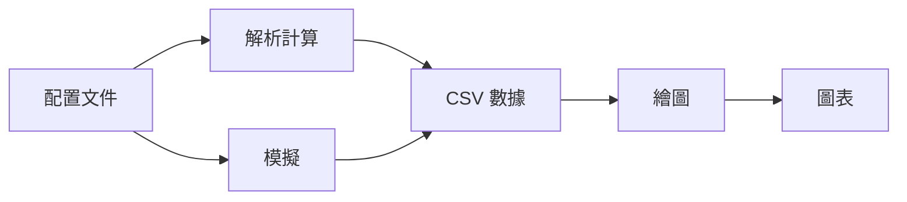

# One-Shot Random Access 模擬與分析系統


> **論文復現項目**：多信道時隙 ALOHA 系統的單次隨機接入（One-Shot Random Access）模擬與分析

---

## 🎯 項目簡介

這是一個用於模擬和分析 MTC（機器類型通信）設備隨機接入行為的系統。

**核心功能**：
- 📐 **理論計算**：使用論文公式計算預期的成功率、延遲、碰撞率
- 🔬 **蒙特卡洛模擬**：用大量隨機實驗驗證理論計算的準確性
- 📊 **結果可視化**：生成論文中的 5 張圖表


```mermaid
graph LR
    YAML[配置文件] --> A[解析計算]
    YAML --> S[模擬]
    A --> CSV[CSV 數據]
    S --> CSV
    CSV --> P[繪圖]
    P --> PNG[圖表]
```

---

## 🚀 快速開始

### 1. 安裝依賴

```bash
git clone <repository-url>
cd FYP-1-One-Shot-Random-Access-New-Architecture
uv sync
```

### 2. 運行程式

```bash
uv run python main.py
```

### 3. 查看結果

輸出位置：`result/graph/figure*/`

---

## ✨ 功能概覽

| 功能                | CLI 命令                              | 耗時      |
| ------------------- | ------------------------------------- | --------- |
| Figure 1 完整流程   | `uv run python main.py run figure1`   | ~2 分鐘   |
| Figure 2 完整流程   | `uv run python main.py run figure2`   | ~2 分鐘   |
| Figure 3-5 完整流程 | `uv run python main.py run figure345` | ~100 分鐘 |
| 所有圖表            | `uv run python main.py run all`       | ~105 分鐘 |

---

## 📁 項目結構

```
FYP-1-One-Shot-Random-Access-New-Architecture/
├── main.py              # 主程式入口
├── config/              # 配置文件
├── analytical/          # 解析計算模組
├── simulation/          # 蒙特卡洛模擬模組
├── plot/                # 繪圖模組
├── result/              # 輸出結果
└── docs/                # 詳細文檔
```

---

## 📚 延伸閱讀

| 文檔                                           | 說明                   |
| ---------------------------------------------- | ---------------------- |
| [詳細安裝指南](docs/guides/GETTING_STARTED.md) | 完整環境設置與首次運行 |
| [系統架構](docs/guides/ARCHITECTURE.md)        | 模組結構與依賴關係     |
| [論文公式](docs/guides/FORMULAS.md)            | Eq.1-10 公式對應與解釋 |
| [配置說明](docs/guides/CONFIGURATION.md)       | YAML 配置文件詳解      |
| [使用指南](docs/guides/USER_GUIDE.md)          | 13 個功能選項完整說明  |
| [輸出說明](docs/guides/OUTPUT_GUIDE.md)        | CSV 和圖表格式說明     |
| [開發指南](docs/guides/DEVELOPMENT.md)         | 代碼規範與擴展指南     |
| [性能監測](docs/guides/PERFORMANCE.md)         | 內置性能監測功能       |
| [常見問題](docs/guides/FAQ.md)                 | FAQ                    |

---

## 📄 參考資料

- **論文**: Chia-Hung Wei et al., "Modeling and Estimation of One-Shot Random Access for Finite-User Multichannel Slotted ALOHA Systems"
- **論文筆記**: [`docs/One-Shot Random Access.md`](docs/One-Shot%20Random%20Access.md)
- **工作流程**: [`workflow/main_workflow.md`](workflow/main_workflow.md)

---

## 📄 License

MIT License
