# Complete Architecture Diagrams / 完整架構圖表

This document contains all architecture diagrams for the One-Shot Random Access project in a single comprehensive file.

本文檔包含 One-Shot Random Access 項目的所有架構圖表，整合在一個完整的文件中。

---

## Table of Contents / 目錄

1. [Structure Diagrams / 結構圖表](#1-structure-diagrams--結構圖表)
   - [Directory Tree / 目錄樹狀圖](#11-directory-tree--目錄樹狀圖)
   - [Project Structure Diagram / 項目結構圖](#12-project-structure-diagram--項目結構圖)
   - [Module Architecture Diagram / 模組架構圖](#13-module-architecture-diagram--模組架構圖)
   - [Project Brace Map / 項目括號圖](#14-project-brace-map--項目括號圖)
   - [Module Brace Map / 模組括號圖](#15-module-brace-map--模組括號圖)

2. [Data Flow Diagrams / 數據流圖表](#2-data-flow-diagrams--數據流圖表)
   - [Data Input-Output Diagram / 數據輸入輸出圖](#21-data-input-output-diagram--數據輸入輸出圖)
   - [Data Flow Diagram / 數據流圖](#22-data-flow-diagram--數據流圖)

3. [Workflow Diagrams / 工作流程圖表](#3-workflow-diagrams--工作流程圖表)
   - [Complete Pipeline Workflow / 完整管道工作流程](#31-complete-pipeline-workflow--完整管道工作流程)
   - [Analytical Phase Workflow / 解析階段工作流程](#32-analytical-phase-workflow--解析階段工作流程)
   - [Simulation Phase Workflow / 模擬階段工作流程](#33-simulation-phase-workflow--模擬階段工作流程)
   - [Plotting Phase Workflow / 繪圖階段工作流程](#34-plotting-phase-workflow--繪圖階段工作流程)
   - [Pipeline Phase Workflow / 管道階段工作流程](#35-pipeline-phase-workflow--管道階段工作流程)
   - [Figure 1 Workflow / Figure 1 工作流程](#36-figure-1-workflow--figure-1-工作流程)
   - [Figure 2 Workflow / Figure 2 工作流程](#37-figure-2-workflow--figure-2-工作流程)
   - [Figure 3-5 Workflow / Figure 3-5 工作流程](#38-figure-3-5-workflow--figure-3-5-工作流程)
   - [Workflow Brace Map / 工作流程括號圖](#39-workflow-brace-map--工作流程括號圖)

4. [Formula Dependency Diagram / 公式依賴圖](#4-formula-dependency-diagram--公式依賴圖)

---

## 1. Structure Diagrams / 結構圖表

### 1.1 Directory Tree / 目錄樹狀圖

This diagram shows the complete directory structure of the One-Shot Random Access project.

本圖表顯示 One-Shot Random Access 項目的完整目錄結構。

```mermaid
graph TD
    Root["FYP-1-One-Shot-Random-Access-New-Architecture<br/>项目根目录"]
    
    Root --> Main["main.py<br/>主程序入口<br/>CLI + 交互式菜单"]
    Root --> Config["config/<br/>配置文件目录"]
    Root --> Analytical["analytical/<br/>解析计算模块"]
    Root --> Simulation["simulation/<br/>模拟模块"]
    Root --> Plot["plot/<br/>绘图模块"]
    Root --> Docs["docs/<br/>文档目录"]
    Root --> Result["result/<br/>结果输出目录"]
    Root --> ProjectFiles["pyproject.toml<br/>uv.lock<br/>README.md<br/>SIMULATION_OPTIMIZATION.md"]
    
    Config --> ConfigInit["__init__.py"]
    Config --> ConfigLoader["loader.py<br/>配置加载器"]
    Config --> ConfigAnalytical["analytical/<br/>解析配置"]
    Config --> ConfigSimulation["simulation/<br/>模拟配置"]
    
    ConfigAnalytical --> Fig1Yaml["figure1.yaml<br/>Figure 1 配置"]
    ConfigAnalytical --> Fig345Yaml["figure345.yaml<br/>Figure 3-5 配置"]
    
    ConfigSimulation --> SimFig345Yaml["figure345.yaml<br/>Figure 3-5 模拟配置"]
    ConfigSimulation --> SinglePointYaml["single_point.yaml<br/>单点测试配置"]
    
    Analytical --> AnalyticalInit["__init__.py"]
    Analytical --> Formulas["formulas.py<br/>论文公式<br/>Eq. 1-10"]
    Analytical --> Theoretical["theoretical.py<br/>理论计算<br/>多周期迭代"]
    Analytical --> FigureAnalysis["figure_analysis/<br/>各图表解析计算"]
    
    FigureAnalysis --> FigAnalysisInit["__init__.py"]
    FigureAnalysis --> Fig1Analysis["figure1_analysis.py<br/>Figure 1 解析<br/>精确 vs 近似公式"]
    FigureAnalysis --> Fig2Analysis["figure2_analysis.py<br/>Figure 2 解析<br/>误差分析"]
    FigureAnalysis --> Fig345Analysis["figure345_analysis.py<br/>Figure 3-5 合并解析<br/>P_S, T_a, P_C"]
    
    Simulation --> SimulationInit["__init__.py"]
    Simulation --> Core["core/<br/>核心模拟引擎"]
    Simulation --> FigureSimulation["figure_simulation/<br/>各图表模拟"]
    
    Core --> CoreInit["__init__.py"]
    Core --> OneShot["one_shot_access.py<br/>单次接入模拟"]
    Core --> GroupPaging["group_paging.py<br/>群组寻呼模拟<br/>多样本并行"]
    Core --> Metrics["metrics.py<br/>性能指标计算"]
    
    FigureSimulation --> FigSimInit["__init__.py"]
    FigureSimulation --> Fig345Sim["figure345_simulation.py<br/>Figure 3-5 合并模拟"]
    
    Plot --> PlotInit["__init__.py"]
    Plot --> Common["common.py<br/>共用绘图设置"]
    Plot --> Fig1Plot["figure1.py<br/>Figure 1 绘图"]
    Plot --> Fig2Plot["figure2.py<br/>Figure 2 绘图"]
    Plot --> Fig345Plot["figure345.py<br/>Figure 3-5 绘图"]
    
    Result --> ResultAnalytical["analytical/<br/>解析结果 CSV"]
    Result --> ResultSimulation["simulation/<br/>模拟结果 CSV"]
    Result --> ResultGraph["graph/<br/>图表输出 PNG"]
    
    ResultAnalytical --> Fig1Result["figure1/<br/>Figure 1 CSV<br/>按时间戳组织"]
    ResultAnalytical --> Fig2Result["figure2/<br/>Figure 2 CSV<br/>按时间戳组织"]
    ResultAnalytical --> Fig345Result["figure345/<br/>Figure 3-5 CSV<br/>按时间戳组织"]
    
    ResultSimulation --> SimFig345Result["figure345/<br/>Figure 3-5 模拟 CSV<br/>按时间戳组织"]
    
    ResultGraph --> GraphFig1["figure1/<br/>Figure 1 PNG<br/>按时间戳组织"]
    ResultGraph --> GraphFig2["figure2/<br/>Figure 2 PNG<br/>按时间戳组织"]
    ResultGraph --> GraphFig345["figure3-5/<br/>Figure 3-5 PNG<br/>按时间戳组织"]
    
    Docs --> PaperPDF["FYP-Paper-1.pdf<br/>论文PDF"]
    Docs --> PaperMD["Paper.md<br/>论文笔记"]
    
    style Root fill:#e1f5ff
    style Main fill:#fff4e1
    style Analytical fill:#e8f5e9
    style Simulation fill:#fce4ec
    style Plot fill:#f3e5f5
    style Config fill:#fff9c4
    style Result fill:#e0f2f1
    style Docs fill:#f1f8e9
```

---

### 1.2 Project Structure Diagram / 項目結構圖

This diagram shows the relationships and dependencies between modules, showing data flow.

本圖表顯示模組間的關係和依賴，展示數據流向。

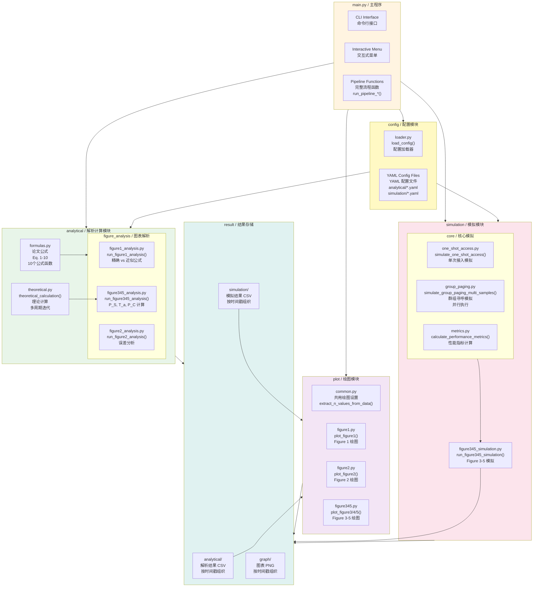

---

### 1.3 Module Architecture Diagram / 模組架構圖

This diagram shows the module architecture and relationships between Analytical, Simulation, and Plot modules.

本圖表顯示模組架構以及解析計算、模擬和繪圖模組之間的關係。

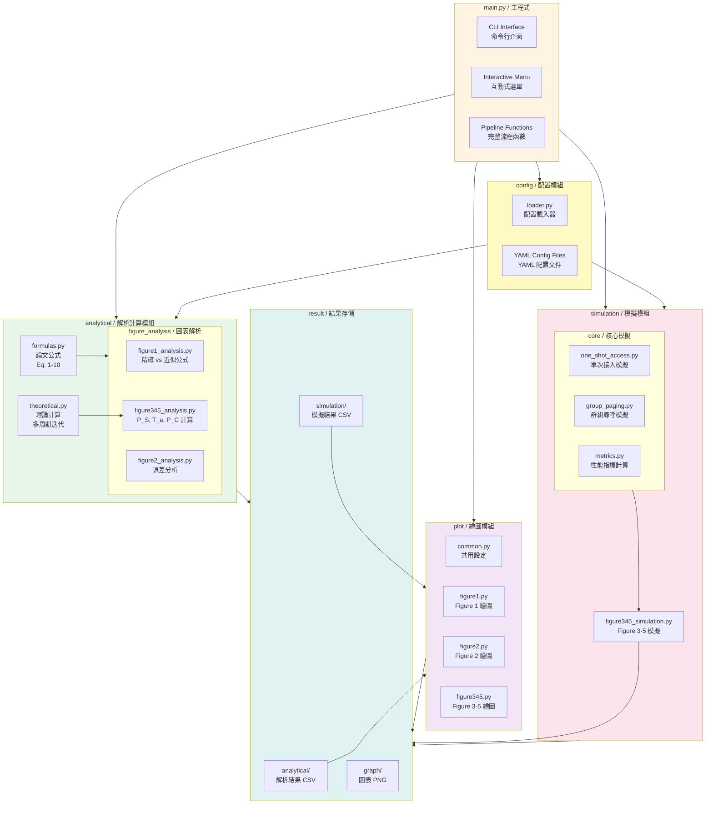

---

### 1.4 Project Brace Map / 項目括號圖

This brace map shows the hierarchical structure of the One-Shot Random Access project.

本括號圖顯示 One-Shot Random Access 項目的層次結構。

```
FYP-1-One-Shot-Random-Access-New-Architecture
├── Main Entry
│   └── main.py (CLI + Interactive Menu)
│
├── Configuration
│   ├── loader.py
│   ├── analytical/
│   │   ├── figure1.yaml
│   │   └── figure345.yaml
│   └── simulation/
│       ├── figure345.yaml
│       └── single_point.yaml
│
├── Analytical Module
│   ├── formulas.py (Eq. 1-10)
│   ├── theoretical.py
│   └── figure_analysis/
│       ├── figure1_analysis.py
│       ├── figure2_analysis.py
│       └── figure345_analysis.py
│
├── Simulation Module
│   ├── core/
│   │   ├── one_shot_access.py
│   │   ├── group_paging.py
│   │   └── metrics.py
│   └── figure_simulation/
│       └── figure345_simulation.py
│
├── Plot Module
│   ├── common.py
│   ├── figure1.py
│   ├── figure2.py
│   └── figure345.py
│
├── Documentation
│   ├── docs/
│   │   ├── FYP-Paper-1.pdf
│   │   └── Paper.md
│   ├── README.md
│   ├── PROJECT_VISUALIZATION.md
│   ├── REPOSITORY_VISUALIZATION.md
│   └── SIMULATION_OPTIMIZATION.md
│
├── Architecture Diagrams
│   ├── structure/
│   │   ├── directory/
│   │   ├── module/
│   │   └── brace_maps/
│   ├── data_flow/
│   │   ├── input_output/
│   │   └── flow/
│   ├── workflows/
│   │   ├── overview/
│   │   ├── phases/
│   │   ├── figures/
│   │   └── brace_maps/
│   └── formulas/
│
└── Output Results
    └── result/
        ├── analytical/
        │   ├── figure1/
        │   ├── figure2/
        │   └── figure345/
        ├── simulation/
        │   └── figure345/
        └── graph/
            ├── figure1/
            ├── figure2/
            └── figure3-5/
```

#### Visual Brace Map Format / 視覺括號圖格式

```
One-Shot Random Access Project
{
    Main Entry
    {
        main.py
    }
    
    Configuration
    {
        loader.py
        analytical/
        {
            figure1.yaml
            figure345.yaml
        }
        simulation/
        {
            figure345.yaml
            single_point.yaml
        }
    }
    
    Analytical Module
    {
        formulas.py (Eq. 1-10)
        theoretical.py
        figure_analysis/
        {
            figure1_analysis.py
            figure2_analysis.py
            figure345_analysis.py
        }
    }
    
    Simulation Module
    {
        core/
        {
            one_shot_access.py
            group_paging.py
            metrics.py
        }
        figure_simulation/
        {
            figure345_simulation.py
        }
    }
    
    Plot Module
    {
        common.py
        figure1.py
        figure2.py
        figure345.py
    }
    
    Documentation
    {
        docs/
        {
            FYP-Paper-1.pdf
            Paper.md
        }
        README.md
        PROJECT_VISUALIZATION.md
        REPOSITORY_VISUALIZATION.md
        SIMULATION_OPTIMIZATION.md
    }
    
    Architecture Diagrams
    {
        structure/
        {
            directory/
            module/
            brace_maps/
        }
        data_flow/
        {
            input_output/
            flow/
        }
        workflows/
        {
            overview/
            phases/
            figures/
            brace_maps/
        }
        formulas/
    }
    
    Output Results
    {
        result/
        {
            analytical/
            {
                figure1/
                figure2/
                figure345/
            }
            simulation/
            {
                figure345/
            }
            graph/
            {
                figure1/
                figure2/
                figure3-5/
            }
        }
    }
}
```

---

### 1.5 Module Brace Map / 模組括號圖

This brace map shows the module relationships and data flow in the project.

本括號圖顯示項目中的模組關係和數據流。

```
One-Shot Random Access System
{
    Main Module (main.py)
    {
        CLI Interface
        Interactive Menu
        Pipeline Functions
    }
    
    Configuration Module
    {
        loader.py
        {
            load_config()
        }
        YAML Files
        {
            analytical/
            {
                figure1.yaml
                figure345.yaml
            }
            simulation/
            {
                figure345.yaml
                single_point.yaml
            }
        }
    }
    
    Analytical Module
    {
        Core Components
        {
            formulas.py
            {
                Eq. 1-10
                {
                    Single Cycle Formulas (Eq. 1-5)
                    Multi-Cycle Formulas (Eq. 6-7)
                    Performance Metrics (Eq. 8-10)
                }
            }
            theoretical.py
            {
                theoretical_calculation()
            }
        }
        Figure Analysis
        {
            figure1_analysis.py
            {
                Exact vs Approximate Formulas
            }
            figure2_analysis.py
            {
                Error Analysis
            }
            figure345_analysis.py
            {
                P_S, T_a, P_C Calculation
            }
        }
        Output
        {
            CSV Files
            {
                figure1/
                figure2/
                figure345/
            }
        }
    }
    
    Simulation Module
    {
        Core Engine
        {
            one_shot_access.py
            {
                Single AC Cycle Simulation
            }
            group_paging.py
            {
                Multi-Sample Parallel Simulation
            }
            metrics.py
            {
                Performance Metrics Calculation
                Mean + Confidence Interval
            }
        }
        Figure Simulation
        {
            figure345_simulation.py
            {
                Monte Carlo Simulation
                Error Calculation
            }
        }
        Output
        {
            CSV Files
            {
                figure345/
                {
                    P_S, T_a, P_C
                    Error Data
                }
            }
        }
    }
    
    Plot Module
    {
        Common Utilities
        {
            common.py
            {
                extract_n_values_from_data()
            }
        }
        Figure Plotters
        {
            figure1.py
            {
                plot_figure1()
            }
            figure2.py
            {
                plot_figure2()
            }
            figure345.py
            {
                plot_figure3()
                plot_figure4()
                plot_figure5()
            }
        }
        Output
        {
            PNG Graphs
            {
                figure1/
                figure2/
                figure3-5/
            }
        }
    }
    
    Data Flow
    {
        Input
        {
            YAML Config Files
        }
        Processing
        {
            Analytical Calculations
            Simulation (Monte Carlo)
            Error Calculation
        }
        Storage
        {
            CSV Files (Analytical Results)
            CSV Files (Simulation Results)
        }
        Visualization
        {
            Load CSV Data
            Generate PNG Graphs
        }
        Output
        {
            PNG Graphs
        }
    }
}
```

---

## 2. Data Flow Diagrams / 數據流圖表

### 2.1 Data Input-Output Diagram / 數據輸入輸出圖

This diagram shows the complete data flow from YAML configs to final PNG graphs.

本圖表顯示從 YAML 配置到最終 PNG 圖表的完整數據流。

```mermaid
flowchart LR
    subgraph Input["Input / 输入"]
        YAMLConfig["YAML Config Files<br/>YAML 配置文件<br/>config/analytical/figure1.yaml<br/>config/analytical/figure345.yaml<br/>config/simulation/figure345.yaml"]
    end
    
    subgraph Processing["Processing / 处理"]
        subgraph Analytical["Analytical / 解析计算"]
            LoadConfig1["load_config()<br/>加载配置"]
            Formulas1["formulas.py<br/>Eq. 1-10<br/>论文公式<br/>精确公式 + 近似公式"]
            Theoretical1["theoretical.py<br/>theoretical_calculation()<br/>多周期迭代计算<br/>I_max 个 AC 周期"]
            FigAnalysis1["figure_analysis/<br/>各图表解析计算<br/>并行计算优化"]
        end
        
        subgraph Simulation["Simulation / 模拟"]
            LoadConfig2["load_config()<br/>加载配置"]
            OneShotSim["one_shot_access.py<br/>单次接入模拟<br/>单个 AC 周期"]
            GroupPagingSim["group_paging.py<br/>群组寻呼模拟<br/>多 AC 周期 + 多样本<br/>并行执行优化"]
            MetricsSim["metrics.py<br/>性能指标计算<br/>均值 + 置信区间"]
            ErrorCalc["Error Calculation<br/>误差计算<br/>|analytical - sim| / |analytical|"]
        end
    end
    
    subgraph Storage["Storage / 存储"]
        CSVAnalytical["CSV Files<br/>CSV 文件<br/>result/analytical/figure1/*.csv<br/>result/analytical/figure2/*.csv<br/>result/analytical/figure345/*.csv"]
        CSVSimulation["CSV Files<br/>CSV 文件<br/>result/simulation/figure345/*.csv<br/>包含误差数据"]
    end
    
    subgraph Visualization["Visualization / 可视化"]
        LoadCSV["Load CSV Data<br/>载入 CSV 数据<br/>load_figure*_results()"]
        PlotFunctions["plot/*.py<br/>绘图函数<br/>plot_figure1/2/3/4/5()"]
        GeneratePNG["Generate PNG<br/>生成 PNG 图表<br/>matplotlib.savefig()"]
    end
    
    subgraph Output["Output / 输出"]
        PNGFiles["PNG Graphs<br/>PNG 图表<br/>result/graph/figure1/*.png<br/>result/graph/figure2/*.png<br/>result/graph/figure3-5/*.png"]
    end
    
    YAMLConfig --> LoadConfig1
    YAMLConfig --> LoadConfig2
    
    LoadConfig1 --> Formulas1
    Formulas1 --> Theoretical1
    Theoretical1 --> FigAnalysis1
    FigAnalysis1 --> CSVAnalytical
    
    LoadConfig2 --> OneShotSim
    OneShotSim --> GroupPagingSim
    GroupPagingSim --> MetricsSim
    MetricsSim --> ErrorCalc
    ErrorCalc --> CSVSimulation
    
    CSVAnalytical --> LoadCSV
    CSVSimulation --> LoadCSV
    LoadCSV --> PlotFunctions
    PlotFunctions --> GeneratePNG
    GeneratePNG --> PNGFiles
    
    CSVAnalytical -.->|"Read for Error Calculation<br/>读取用于误差计算"| ErrorCalc
    
    style Input fill:#e3f2fd
    style Processing fill:#fff9c4
    style Storage fill:#e8f5e9
    style Visualization fill:#f3e5f5
    style Output fill:#e0f2f1
```

---

### 2.2 Data Flow Diagram / 數據流圖

This diagram shows how data moves from YAML configs through processing to final PNG outputs.

本圖表顯示數據如何從 YAML 配置通過處理流向最終的 PNG 輸出。

```mermaid
flowchart LR
    subgraph Input["Input / 輸入"]
        YAMLConfig["YAML Config Files<br/>YAML 配置文件<br/>config/analytical/*.yaml<br/>config/simulation/*.yaml"]
    end
    
    subgraph Processing["Processing / 處理"]
        subgraph Analytical["Analytical / 解析計算"]
            LoadConfig1["load_config()<br/>載入配置"]
            Formulas1["formulas.py<br/>Eq. 1-10<br/>論文公式"]
            Theoretical1["theoretical.py<br/>多周期迭代計算"]
            FigAnalysis1["figure_analysis/<br/>各圖表解析計算"]
        end
        
        subgraph Simulation["Simulation / 模擬"]
            LoadConfig2["load_config()<br/>載入配置"]
            OneShotSim["one_shot_access.py<br/>單次接入模擬"]
            GroupPagingSim["group_paging.py<br/>群組尋呼模擬"]
            MetricsSim["metrics.py<br/>性能指標計算"]
            ErrorCalc["Error Calculation<br/>誤差計算<br/>|analytical - sim| / |analytical|"]
        end
    end
    
    subgraph Storage["Storage / 存儲"]
        CSVAnalytical["CSV Files<br/>CSV 文件<br/>result/analytical/*.csv"]
        CSVSimulation["CSV Files<br/>CSV 文件<br/>result/simulation/*.csv"]
    end
    
    subgraph Visualization["Visualization / 可視化"]
        LoadCSV["Load CSV Data<br/>載入 CSV 數據"]
        PlotFunctions["plot/*.py<br/>繪圖函數"]
        GeneratePNG["Generate PNG<br/>生成 PNG 圖表"]
    end
    
    subgraph Output["Output / 輸出"]
        PNGFiles["PNG Graphs<br/>PNG 圖表<br/>result/graph/*.png"]
    end
    
    YAMLConfig --> LoadConfig1
    YAMLConfig --> LoadConfig2
    
    LoadConfig1 --> Formulas1
    Formulas1 --> Theoretical1
    Theoretical1 --> FigAnalysis1
    FigAnalysis1 --> CSVAnalytical
    
    LoadConfig2 --> OneShotSim
    OneShotSim --> GroupPagingSim
    GroupPagingSim --> MetricsSim
    MetricsSim --> ErrorCalc
    ErrorCalc --> CSVSimulation
    
    CSVAnalytical --> LoadCSV
    CSVSimulation --> LoadCSV
    LoadCSV --> PlotFunctions
    PlotFunctions --> GeneratePNG
    GeneratePNG --> PNGFiles
    
    CSVAnalytical -.->|"Read for Error Calculation<br/>讀取用於誤差計算"| ErrorCalc
    
    style Input fill:#e3f2fd
    style Processing fill:#fff9c4
    style Storage fill:#e8f5e9
    style Visualization fill:#f3e5f5
    style Output fill:#e0f2f1
```

---

## 3. Workflow Diagrams / 工作流程圖表

### 3.1 Complete Pipeline Workflow / 完整管道工作流程

This diagram shows the high-level overview of the complete pipeline workflow.

本圖表顯示完整管道工作流程的高層次概覽。

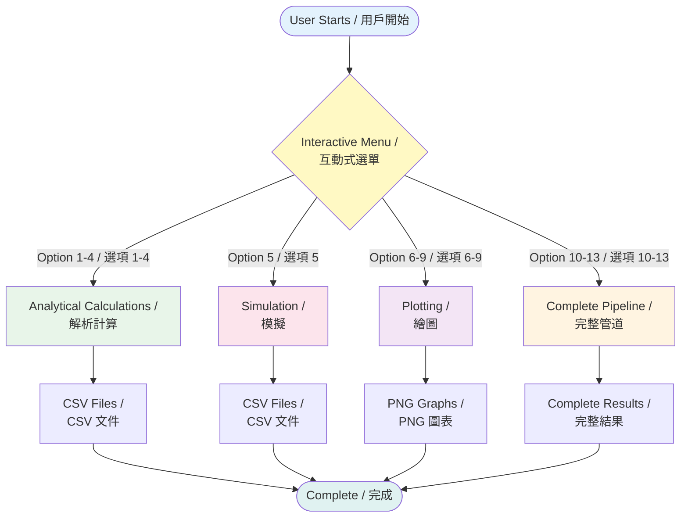

---

### 3.2 Analytical Phase Workflow / 解析階段工作流程

This diagram shows the detailed workflow for the analytical calculation phase.

本圖表顯示解析計算階段的詳細工作流程。

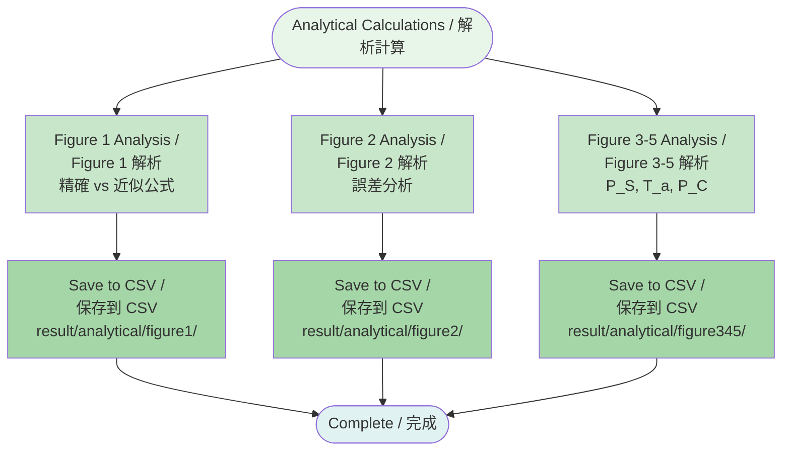

---

### 3.3 Simulation Phase Workflow / 模擬階段工作流程

This diagram shows the detailed workflow for the simulation phase.

本圖表顯示模擬階段的詳細工作流程。

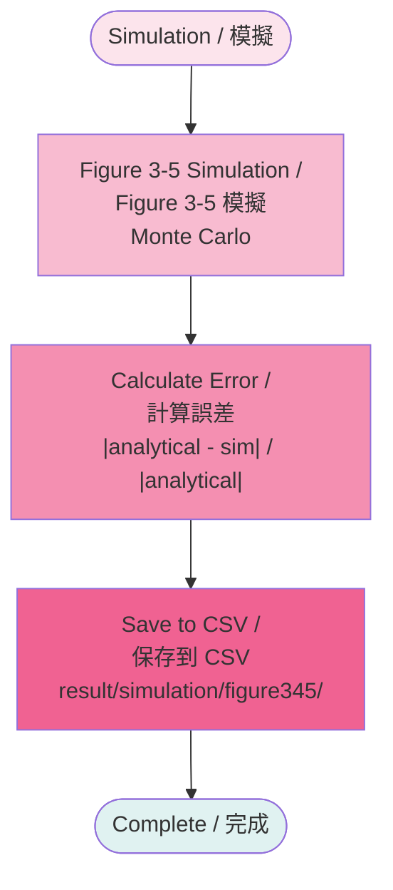

---

### 3.4 Plotting Phase Workflow / 繪圖階段工作流程

This diagram shows the detailed workflow for the plotting phase.

本圖表顯示繪圖階段的詳細工作流程。

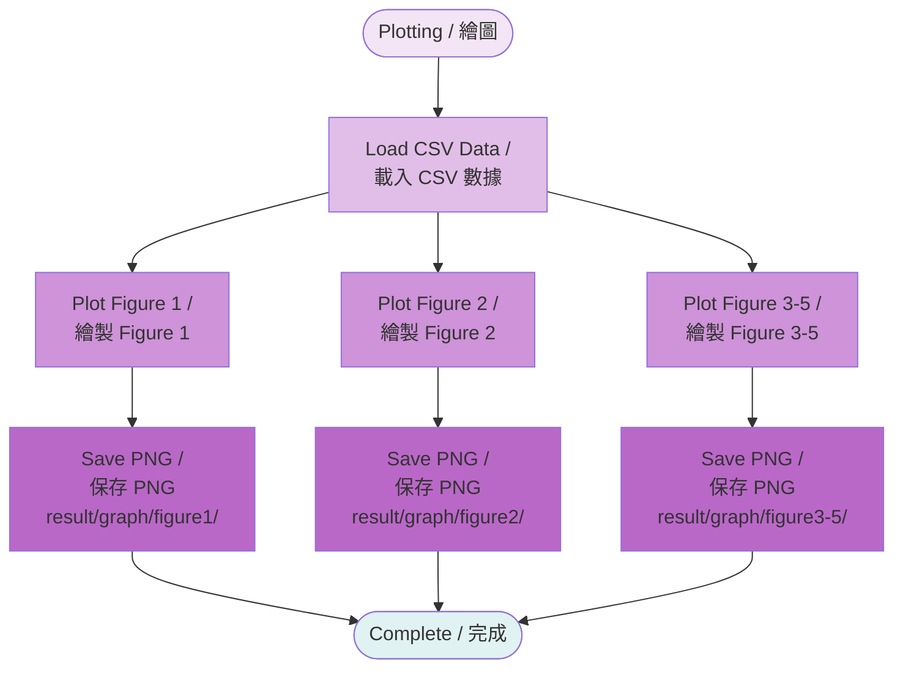

---

### 3.5 Pipeline Phase Workflow / 管道階段工作流程

This diagram shows the detailed workflow for the complete pipeline phase, which combines analytical, simulation, and plotting phases.

本圖表顯示完整管道階段的詳細工作流程，該階段結合了解析、模擬和繪圖階段。

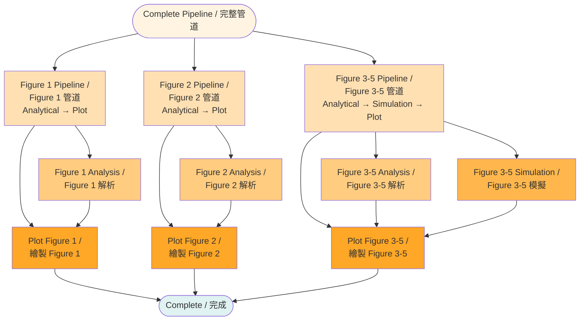

---

### 3.6 Figure 1 Workflow / Figure 1 工作流程

This diagram shows the detailed execution flow for Figure 1 analysis and plotting.

本圖表顯示 Figure 1 分析和繪圖的詳細執行流程。

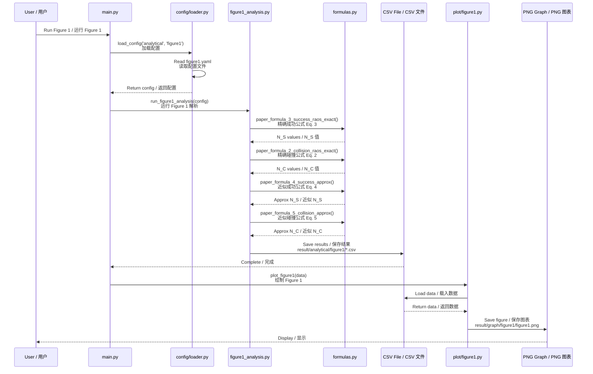

---

### 3.7 Figure 2 Workflow / Figure 2 工作流程

This diagram shows the detailed execution flow for Figure 2 error analysis and plotting.

本圖表顯示 Figure 2 誤差分析和繪圖的詳細執行流程。

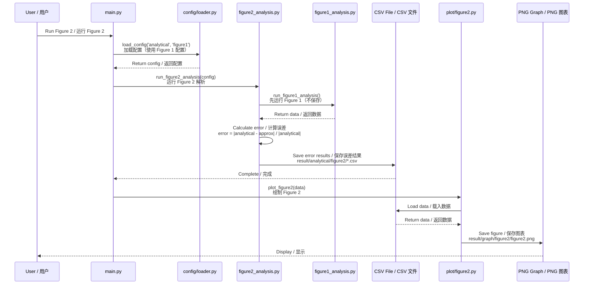

---

### 3.8 Figure 3-5 Workflow / Figure 3-5 工作流程

This diagram shows the detailed execution flow for Figure 3-5 analysis, simulation, and plotting.

本圖表顯示 Figure 3-5 分析、模擬和繪圖的詳細執行流程。

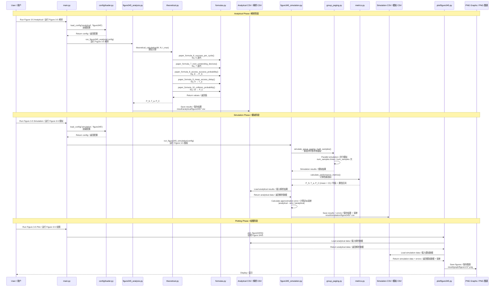

---

### 3.9 Workflow Brace Map / 工作流程括號圖

This brace map shows the complete workflow structure of the project.

本括號圖顯示項目的完整工作流程結構。

```
Complete Workflow System
{
    User Interaction
    {
        Interactive Menu
        {
            Option 1-4: Analytical Calculations
            Option 5: Simulation
            Option 6-9: Plotting
            Option 10-13: Complete Pipeline
        }
    }
    
    Analytical Phase
    {
        Figure 1 Analysis
        {
            Load Config (figure1.yaml)
            Calculate
            {
                Exact Formulas (Eq. 2, 3)
                Approximate Formulas (Eq. 4, 5)
            }
            Save to CSV
            {
                result/analytical/figure1/
            }
        }
        Figure 2 Analysis
        {
            Load Config (figure1.yaml)
            Run Figure 1 (internal)
            Calculate Error
            {
                |analytical - approx| / |analytical|
            }
            Save to CSV
            {
                result/analytical/figure2/
            }
        }
        Figure 3-5 Analysis
        {
            Load Config (figure345.yaml)
            Theoretical Calculation
            {
                Multi-Cycle Iteration (Eq. 6, 7)
                Performance Metrics
                {
                    P_S (Eq. 8)
                    T_a (Eq. 9)
                    P_C (Eq. 10)
                }
            }
            Save to CSV
            {
                result/analytical/figure345/
            }
        }
    }
    
    Simulation Phase
    {
        Figure 3-5 Simulation
        {
            Load Config (figure345.yaml)
            Group Paging Simulation
            {
                Parallel Multi-Sample
                {
                    num_samples iterations
                }
            }
            Calculate Metrics
            {
                Mean + Confidence Interval
            }
            Calculate Error
            {
                |analytical - sim| / |analytical|
            }
            Save to CSV
            {
                result/simulation/figure345/
            }
        }
    }
    
    Plotting Phase
    {
        Load CSV Data
        {
            From analytical/
            From simulation/
        }
        Plot Figures
        {
            Figure 1
            {
                plot_figure1()
                Save PNG
                {
                    result/graph/figure1/
                }
            }
            Figure 2
            {
                plot_figure2()
                Save PNG
                {
                    result/graph/figure2/
                }
            }
            Figure 3-5
            {
                plot_figure3()
                plot_figure4()
                plot_figure5()
                Save PNG
                {
                    result/graph/figure3-5/
                }
            }
        }
    }
    
    Complete Pipeline
    {
        Figure 1 Pipeline
        {
            Analytical Phase
            Plotting Phase
        }
        Figure 2 Pipeline
        {
            Analytical Phase
            Plotting Phase
        }
        Figure 3-5 Pipeline
        {
            Analytical Phase
            Simulation Phase
            Plotting Phase
        }
    }
}
```

---

## 4. Formula Dependency Diagram / 公式依賴圖

This diagram shows the dependency relationships between the 10 paper formulas and their correspondence with figures.

本圖表顯示 10 個論文公式之間的依賴關係及其與圖表的對應。

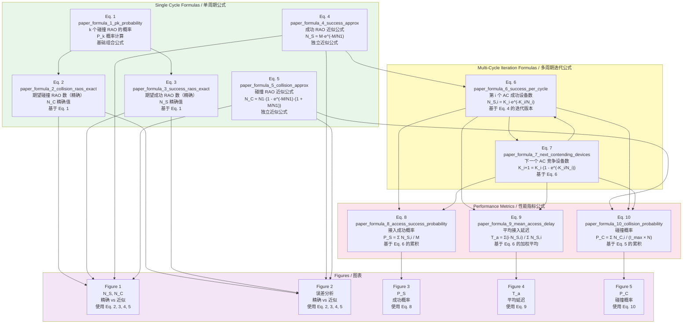

---

## Summary / 總結

This comprehensive document contains all architecture diagrams for the One-Shot Random Access project, including:

本文檔包含 One-Shot Random Access 項目的所有架構圖表，包括：

1. **Structure Diagrams / 結構圖表**: Directory tree, project structure, module architecture, and brace maps
2. **Data Flow Diagrams / 數據流圖表**: Input-output flow and data movement through the system
3. **Workflow Diagrams / 工作流程圖表**: Complete pipeline, phase workflows, figure-specific workflows, and brace maps
4. **Formula Dependency Diagram / 公式依賴圖**: Relationships between the 10 paper formulas

All diagrams use bilingual labels (English / 中文) for better understanding and are organized in a logical structure for easy navigation.

所有圖表都使用雙語標籤（英文 / 中文）以便更好地理解，並以邏輯結構組織，便於導航。

