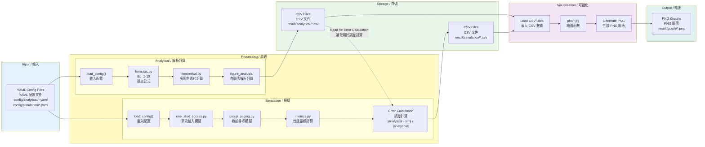

# Data Flow Diagram / 數據流圖

This diagram shows how data moves from YAML configs through processing to final PNG outputs.

本圖表顯示數據如何從 YAML 配置通過處理流向最終的 PNG 輸出。

```mermaid
flowchart LR
    subgraph Input["Input / 輸入"]
        YAMLConfig["YAML Config Files<br/>YAML 配置文件<br/>config/analytical/*.yaml<br/>config/simulation/*.yaml"]
    end
    
    subgraph Processing["Processing / 處理"]
        subgraph Analytical["Analytical / 解析計算"]
            LoadConfig1["load_config()<br/>載入配置"]
            Formulas1["formulas.py<br/>Eq. 1-10<br/>論文公式"]
            Theoretical1["theoretical.py<br/>多周期迭代計算"]
            FigAnalysis1["figure_analysis/<br/>各圖表解析計算"]
        end
        
        subgraph Simulation["Simulation / 模擬"]
            LoadConfig2["load_config()<br/>載入配置"]
            OneShotSim["one_shot_access.py<br/>單次接入模擬"]
            GroupPagingSim["group_paging.py<br/>群組尋呼模擬"]
            MetricsSim["metrics.py<br/>性能指標計算"]
            ErrorCalc["Error Calculation<br/>誤差計算<br/>|analytical - sim| / |analytical|"]
        end
    end
    
    subgraph Storage["Storage / 存儲"]
        CSVAnalytical["CSV Files<br/>CSV 文件<br/>result/analytical/*.csv"]
        CSVSimulation["CSV Files<br/>CSV 文件<br/>result/simulation/*.csv"]
    end
    
    subgraph Visualization["Visualization / 可視化"]
        LoadCSV["Load CSV Data<br/>載入 CSV 數據"]
        PlotFunctions["plot/*.py<br/>繪圖函數"]
        GeneratePNG["Generate PNG<br/>生成 PNG 圖表"]
    end
    
    subgraph Output["Output / 輸出"]
        PNGFiles["PNG Graphs<br/>PNG 圖表<br/>result/graph/*.png"]
    end
    
    YAMLConfig --> LoadConfig1
    YAMLConfig --> LoadConfig2
    
    LoadConfig1 --> Formulas1
    Formulas1 --> Theoretical1
    Theoretical1 --> FigAnalysis1
    FigAnalysis1 --> CSVAnalytical
    
    LoadConfig2 --> OneShotSim
    OneShotSim --> GroupPagingSim
    GroupPagingSim --> MetricsSim
    MetricsSim --> ErrorCalc
    ErrorCalc --> CSVSimulation
    
    CSVAnalytical --> LoadCSV
    CSVSimulation --> LoadCSV
    LoadCSV --> PlotFunctions
    PlotFunctions --> GeneratePNG
    GeneratePNG --> PNGFiles
    
    CSVAnalytical -.->|"Read for Error Calculation<br/>讀取用於誤差計算"| ErrorCalc
    
    style Input fill:#e3f2fd
    style Processing fill:#fff9c4
    style Storage fill:#e8f5e9
    style Visualization fill:#f3e5f5
    style Output fill:#e0f2f1
```

