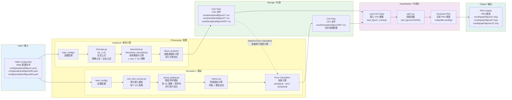

# Data Input-Output Diagram / 數據輸入輸出圖

This diagram shows the complete data flow from YAML configs to final PNG graphs.

本圖表顯示從 YAML 配置到最終 PNG 圖表的完整數據流。

```mermaid
flowchart LR
    subgraph Input["Input / 输入"]
        YAMLConfig["YAML Config Files<br/>YAML 配置文件<br/>config/analytical/figure1.yaml<br/>config/analytical/figure345.yaml<br/>config/simulation/figure345.yaml"]
    end
    
    subgraph Processing["Processing / 处理"]
        subgraph Analytical["Analytical / 解析计算"]
            LoadConfig1["load_config()<br/>加载配置"]
            Formulas1["formulas.py<br/>Eq. 1-10<br/>论文公式<br/>精确公式 + 近似公式"]
            Theoretical1["theoretical.py<br/>theoretical_calculation()<br/>多周期迭代计算<br/>I_max 个 AC 周期"]
            FigAnalysis1["figure_analysis/<br/>各图表解析计算<br/>并行计算优化"]
        end
        
        subgraph Simulation["Simulation / 模拟"]
            LoadConfig2["load_config()<br/>加载配置"]
            OneShotSim["one_shot_access.py<br/>单次接入模拟<br/>单个 AC 周期"]
            GroupPagingSim["group_paging.py<br/>群组寻呼模拟<br/>多 AC 周期 + 多样本<br/>并行执行优化"]
            MetricsSim["metrics.py<br/>性能指标计算<br/>均值 + 置信区间"]
            ErrorCalc["Error Calculation<br/>误差计算<br/>|analytical - sim| / |analytical|"]
        end
    end
    
    subgraph Storage["Storage / 存储"]
        CSVAnalytical["CSV Files<br/>CSV 文件<br/>result/analytical/figure1/*.csv<br/>result/analytical/figure2/*.csv<br/>result/analytical/figure345/*.csv"]
        CSVSimulation["CSV Files<br/>CSV 文件<br/>result/simulation/figure345/*.csv<br/>包含误差数据"]
    end
    
    subgraph Visualization["Visualization / 可视化"]
        LoadCSV["Load CSV Data<br/>载入 CSV 数据<br/>load_figure*_results()"]
        PlotFunctions["plot/*.py<br/>绘图函数<br/>plot_figure1/2/3/4/5()"]
        GeneratePNG["Generate PNG<br/>生成 PNG 图表<br/>matplotlib.savefig()"]
    end
    
    subgraph Output["Output / 输出"]
        PNGFiles["PNG Graphs<br/>PNG 图表<br/>result/graph/figure1/*.png<br/>result/graph/figure2/*.png<br/>result/graph/figure3-5/*.png"]
    end
    
    YAMLConfig --> LoadConfig1
    YAMLConfig --> LoadConfig2
    
    LoadConfig1 --> Formulas1
    Formulas1 --> Theoretical1
    Theoretical1 --> FigAnalysis1
    FigAnalysis1 --> CSVAnalytical
    
    LoadConfig2 --> OneShotSim
    OneShotSim --> GroupPagingSim
    GroupPagingSim --> MetricsSim
    MetricsSim --> ErrorCalc
    ErrorCalc --> CSVSimulation
    
    CSVAnalytical --> LoadCSV
    CSVSimulation --> LoadCSV
    LoadCSV --> PlotFunctions
    PlotFunctions --> GeneratePNG
    GeneratePNG --> PNGFiles
    
    CSVAnalytical -.->|"Read for Error Calculation<br/>读取用于误差计算"| ErrorCalc
    
    style Input fill:#e3f2fd
    style Processing fill:#fff9c4
    style Storage fill:#e8f5e9
    style Visualization fill:#f3e5f5
    style Output fill:#e0f2f1
```

