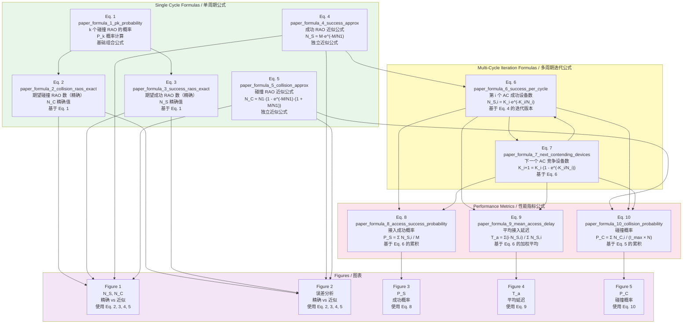

# Formula Dependency Diagram / 公式依賴圖

This diagram shows the dependency relationships between the 10 paper formulas and their correspondence with figures.

本圖表顯示 10 個論文公式之間的依賴關係及其與圖表的對應。

```mermaid
graph TB
    subgraph SingleCycle["Single Cycle Formulas / 单周期公式"]
        Eq1["Eq. 1<br/>paper_formula_1_pk_probability<br/>k 个碰撞 RAO 的概率<br/>P_k 概率计算<br/>基础组合公式"]
        
        Eq2["Eq. 2<br/>paper_formula_2_collision_raos_exact<br/>期望碰撞 RAO 数（精确）<br/>N_C 精确值<br/>基于 Eq. 1"]
        
        Eq3["Eq. 3<br/>paper_formula_3_success_raos_exact<br/>期望成功 RAO 数（精确）<br/>N_S 精确值<br/>基于 Eq. 1"]
        
        Eq4["Eq. 4<br/>paper_formula_4_success_approx<br/>成功 RAO 近似公式<br/>N_S ≈ M·e^(-M/N1)<br/>独立近似公式"]
        
        Eq5["Eq. 5<br/>paper_formula_5_collision_approx<br/>碰撞 RAO 近似公式<br/>N_C ≈ N1·(1 - e^(-M/N1)·(1 + M/N1))<br/>独立近似公式"]
    end
    
    subgraph MultiCycle["Multi-Cycle Iteration Formulas / 多周期迭代公式"]
        Eq6["Eq. 6<br/>paper_formula_6_success_per_cycle<br/>第 i 个 AC 成功设备数<br/>N_S,i = K_i·e^(-K_i/N_i)<br/>基于 Eq. 4 的迭代版本"]
        
        Eq7["Eq. 7<br/>paper_formula_7_next_contending_devices<br/>下一个 AC 竞争设备数<br/>K_i+1 = K_i·(1 - e^(-K_i/N_i))<br/>基于 Eq. 6"]
    end
    
    subgraph Performance["Performance Metrics / 性能指标公式"]
        Eq8["Eq. 8<br/>paper_formula_8_access_success_probability<br/>接入成功概率<br/>P_S = Σ N_S,i / M<br/>基于 Eq. 6 的累积"]
        
        Eq9["Eq. 9<br/>paper_formula_9_mean_access_delay<br/>平均接入延迟<br/>T_a = Σ(i·N_S,i) / Σ N_S,i<br/>基于 Eq. 6 的加权平均"]
        
        Eq10["Eq. 10<br/>paper_formula_10_collision_probability<br/>碰撞概率<br/>P_C = Σ N_C,i / (I_max × N)<br/>基于 Eq. 5 的累积"]
    end
    
    subgraph Figures["Figures / 图表"]
        Fig1["Figure 1<br/>N_S, N_C<br/>精确 vs 近似<br/>使用 Eq. 2, 3, 4, 5"]
        Fig2["Figure 2<br/>误差分析<br/>精确 vs 近似<br/>使用 Eq. 2, 3, 4, 5"]
        Fig3["Figure 3<br/>P_S<br/>成功概率<br/>使用 Eq. 8"]
        Fig4["Figure 4<br/>T_a<br/>平均延迟<br/>使用 Eq. 9"]
        Fig5["Figure 5<br/>P_C<br/>碰撞概率<br/>使用 Eq. 10"]
    end
    
    Eq1 --> Eq2
    Eq1 --> Eq3
    
    Eq2 --> Fig1
    Eq3 --> Fig1
    Eq4 --> Fig1
    Eq5 --> Fig1
    
    Eq2 --> Fig2
    Eq3 --> Fig2
    Eq4 --> Fig2
    Eq5 --> Fig2
    
    Eq4 --> Eq6
    Eq5 --> Eq10
    
    Eq6 --> Eq7
    Eq7 --> Eq6
    
    Eq6 --> Eq8
    Eq6 --> Eq9
    Eq6 --> Eq10
    
    Eq7 --> Eq8
    Eq7 --> Eq9
    Eq7 --> Eq10
    
    Eq8 --> Fig3
    Eq9 --> Fig4
    Eq10 --> Fig5
    
    style SingleCycle fill:#e8f5e9
    style MultiCycle fill:#fff9c4
    style Performance fill:#fce4ec
    style Figures fill:#f3e5f5
```

