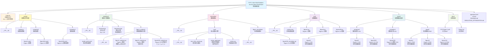

# Directory Tree / 目錄樹狀圖

This diagram shows the complete directory structure of the One-Shot Random Access project.

本圖表顯示 One-Shot Random Access 項目的完整目錄結構。

```mermaid
graph TD
    Root["FYP-1-One-Shot-Random-Access-New-Architecture<br/>项目根目录"]
    
    Root --> Main["main.py<br/>主程序入口<br/>CLI + 交互式菜单"]
    Root --> Config["config/<br/>配置文件目录"]
    Root --> Analytical["analytical/<br/>解析计算模块"]
    Root --> Simulation["simulation/<br/>模拟模块"]
    Root --> Plot["plot/<br/>绘图模块"]
    Root --> Docs["docs/<br/>文档目录"]
    Root --> Result["result/<br/>结果输出目录"]
    Root --> ProjectFiles["pyproject.toml<br/>uv.lock<br/>README.md<br/>SIMULATION_OPTIMIZATION.md"]
    
    Config --> ConfigInit["__init__.py"]
    Config --> ConfigLoader["loader.py<br/>配置加载器"]
    Config --> ConfigAnalytical["analytical/<br/>解析配置"]
    Config --> ConfigSimulation["simulation/<br/>模拟配置"]
    
    ConfigAnalytical --> Fig1Yaml["figure1.yaml<br/>Figure 1 配置"]
    ConfigAnalytical --> Fig345Yaml["figure345.yaml<br/>Figure 3-5 配置"]
    
    ConfigSimulation --> SimFig345Yaml["figure345.yaml<br/>Figure 3-5 模拟配置"]
    ConfigSimulation --> SinglePointYaml["single_point.yaml<br/>单点测试配置"]
    
    Analytical --> AnalyticalInit["__init__.py"]
    Analytical --> Formulas["formulas.py<br/>论文公式<br/>Eq. 1-10"]
    Analytical --> Theoretical["theoretical.py<br/>理论计算<br/>多周期迭代"]
    Analytical --> FigureAnalysis["figure_analysis/<br/>各图表解析计算"]
    
    FigureAnalysis --> FigAnalysisInit["__init__.py"]
    FigureAnalysis --> Fig1Analysis["figure1_analysis.py<br/>Figure 1 解析<br/>精确 vs 近似公式"]
    FigureAnalysis --> Fig2Analysis["figure2_analysis.py<br/>Figure 2 解析<br/>误差分析"]
    FigureAnalysis --> Fig345Analysis["figure345_analysis.py<br/>Figure 3-5 合并解析<br/>P_S, T_a, P_C"]
    
    Simulation --> SimulationInit["__init__.py"]
    Simulation --> Core["core/<br/>核心模拟引擎"]
    Simulation --> FigureSimulation["figure_simulation/<br/>各图表模拟"]
    
    Core --> CoreInit["__init__.py"]
    Core --> OneShot["one_shot_access.py<br/>单次接入模拟"]
    Core --> GroupPaging["group_paging.py<br/>群组寻呼模拟<br/>多样本并行"]
    Core --> Metrics["metrics.py<br/>性能指标计算"]
    
    FigureSimulation --> FigSimInit["__init__.py"]
    FigureSimulation --> Fig345Sim["figure345_simulation.py<br/>Figure 3-5 合并模拟"]
    
    Plot --> PlotInit["__init__.py"]
    Plot --> Common["common.py<br/>共用绘图设置"]
    Plot --> Fig1Plot["figure1.py<br/>Figure 1 绘图"]
    Plot --> Fig2Plot["figure2.py<br/>Figure 2 绘图"]
    Plot --> Fig345Plot["figure345.py<br/>Figure 3-5 绘图"]
    
    Result --> ResultAnalytical["analytical/<br/>解析结果 CSV"]
    Result --> ResultSimulation["simulation/<br/>模拟结果 CSV"]
    Result --> ResultGraph["graph/<br/>图表输出 PNG"]
    
    ResultAnalytical --> Fig1Result["figure1/<br/>Figure 1 CSV<br/>按时间戳组织"]
    ResultAnalytical --> Fig2Result["figure2/<br/>Figure 2 CSV<br/>按时间戳组织"]
    ResultAnalytical --> Fig345Result["figure345/<br/>Figure 3-5 CSV<br/>按时间戳组织"]
    
    ResultSimulation --> SimFig345Result["figure345/<br/>Figure 3-5 模拟 CSV<br/>按时间戳组织"]
    
    ResultGraph --> GraphFig1["figure1/<br/>Figure 1 PNG<br/>按时间戳组织"]
    ResultGraph --> GraphFig2["figure2/<br/>Figure 2 PNG<br/>按时间戳组织"]
    ResultGraph --> GraphFig345["figure3-5/<br/>Figure 3-5 PNG<br/>按时间戳组织"]
    
    Docs --> PaperPDF["FYP-Paper-1.pdf<br/>论文PDF"]
    Docs --> PaperMD["Paper.md<br/>论文笔记"]
    
    style Root fill:#e1f5ff
    style Main fill:#fff4e1
    style Analytical fill:#e8f5e9
    style Simulation fill:#fce4ec
    style Plot fill:#f3e5f5
    style Config fill:#fff9c4
    style Result fill:#e0f2f1
    style Docs fill:#f1f8e9
```

