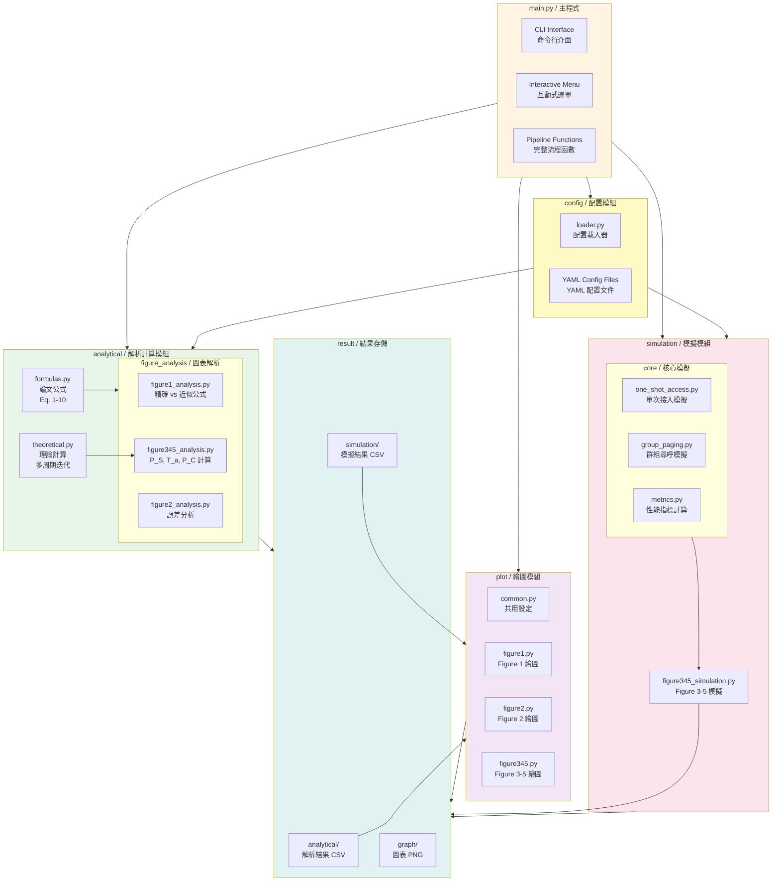

# Module Architecture Diagram / 模組架構圖

This diagram shows the module architecture and relationships between Analytical, Simulation, and Plot modules.

本圖表顯示模組架構以及解析計算、模擬和繪圖模組之間的關係。

```mermaid
graph TB
    subgraph MainModule["main.py / 主程式"]
        CLI["CLI Interface<br/>命令行介面"]
        InteractiveMenu["Interactive Menu<br/>互動式選單"]
        Pipeline["Pipeline Functions<br/>完整流程函數"]
    end
    
    subgraph ConfigModule["config / 配置模組"]
        Loader["loader.py<br/>配置載入器"]
        YAMLFiles["YAML Config Files<br/>YAML 配置文件"]
    end
    
    subgraph AnalyticalModule["analytical / 解析計算模組"]
        Formulas["formulas.py<br/>論文公式<br/>Eq. 1-10"]
        Theoretical["theoretical.py<br/>理論計算<br/>多周期迭代"]
        
        subgraph FigAnalysis["figure_analysis / 圖表解析"]
            Fig1Analysis["figure1_analysis.py<br/>精確 vs 近似公式"]
            Fig2Analysis["figure2_analysis.py<br/>誤差分析"]
            Fig345Analysis["figure345_analysis.py<br/>P_S, T_a, P_C 計算"]
        end
    end
    
    subgraph SimulationModule["simulation / 模擬模組"]
        subgraph CoreSim["core / 核心模擬"]
            OneShot["one_shot_access.py<br/>單次接入模擬"]
            GroupPaging["group_paging.py<br/>群組尋呼模擬"]
            Metrics["metrics.py<br/>性能指標計算"]
        end
        
        Fig345Sim["figure345_simulation.py<br/>Figure 3-5 模擬"]
    end
    
    subgraph PlotModule["plot / 繪圖模組"]
        Common["common.py<br/>共用設定"]
        Fig1Plot["figure1.py<br/>Figure 1 繪圖"]
        Fig2Plot["figure2.py<br/>Figure 2 繪圖"]
        Fig345Plot["figure345.py<br/>Figure 3-5 繪圖"]
    end
    
    subgraph Storage["result / 結果存儲"]
        CSVAnalytical["analytical/<br/>解析結果 CSV"]
        CSVSimulation["simulation/<br/>模擬結果 CSV"]
        PNGGraphs["graph/<br/>圖表 PNG"]
    end
    
    MainModule --> ConfigModule
    MainModule --> AnalyticalModule
    MainModule --> SimulationModule
    MainModule --> PlotModule
    
    ConfigModule --> AnalyticalModule
    ConfigModule --> SimulationModule
    
    AnalyticalModule --> Storage
    SimulationModule --> Storage
    PlotModule --> Storage
    
    Formulas --> FigAnalysis
    Theoretical --> Fig345Analysis
    
    CoreSim --> Fig345Sim
    Fig345Sim --> Storage
    
    CSVAnalytical --> PlotModule
    CSVSimulation --> PlotModule
    
    style MainModule fill:#fff4e1
    style ConfigModule fill:#fff9c4
    style AnalyticalModule fill:#e8f5e9
    style SimulationModule fill:#fce4ec
    style PlotModule fill:#f3e5f5
    style Storage fill:#e0f2f1
```

