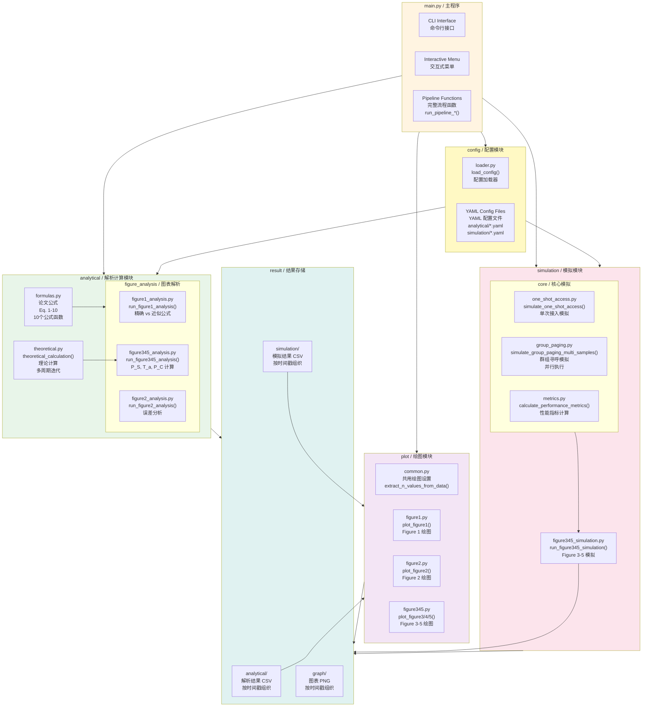

# Project Structure Diagram / 项目结构图

This diagram shows the relationships and dependencies between modules, showing data flow.

本圖表顯示模組間的關係和依賴，展示數據流向。

```mermaid
graph TB
    subgraph MainModule["main.py / 主程序"]
        CLI["CLI Interface<br/>命令行接口"]
        InteractiveMenu["Interactive Menu<br/>交互式菜单"]
        Pipeline["Pipeline Functions<br/>完整流程函数<br/>run_pipeline_*()"]
    end
    
    subgraph ConfigModule["config / 配置模块"]
        Loader["loader.py<br/>load_config()<br/>配置加载器"]
        YAMLFiles["YAML Config Files<br/>YAML 配置文件<br/>analytical/*.yaml<br/>simulation/*.yaml"]
    end
    
    subgraph AnalyticalModule["analytical / 解析计算模块"]
        Formulas["formulas.py<br/>论文公式<br/>Eq. 1-10<br/>10个公式函数"]
        Theoretical["theoretical.py<br/>theoretical_calculation()<br/>理论计算<br/>多周期迭代"]
        
        subgraph FigAnalysis["figure_analysis / 图表解析"]
            Fig1Analysis["figure1_analysis.py<br/>run_figure1_analysis()<br/>精确 vs 近似公式"]
            Fig2Analysis["figure2_analysis.py<br/>run_figure2_analysis()<br/>误差分析"]
            Fig345Analysis["figure345_analysis.py<br/>run_figure345_analysis()<br/>P_S, T_a, P_C 计算"]
        end
    end
    
    subgraph SimulationModule["simulation / 模拟模块"]
        subgraph CoreSim["core / 核心模拟"]
            OneShot["one_shot_access.py<br/>simulate_one_shot_access()<br/>单次接入模拟"]
            GroupPaging["group_paging.py<br/>simulate_group_paging_multi_samples()<br/>群组寻呼模拟<br/>并行执行"]
            Metrics["metrics.py<br/>calculate_performance_metrics()<br/>性能指标计算"]
        end
        
        Fig345Sim["figure345_simulation.py<br/>run_figure345_simulation()<br/>Figure 3-5 模拟"]
    end
    
    subgraph PlotModule["plot / 绘图模块"]
        Common["common.py<br/>共用绘图设置<br/>extract_n_values_from_data()"]
        Fig1Plot["figure1.py<br/>plot_figure1()<br/>Figure 1 绘图"]
        Fig2Plot["figure2.py<br/>plot_figure2()<br/>Figure 2 绘图"]
        Fig345Plot["figure345.py<br/>plot_figure3/4/5()<br/>Figure 3-5 绘图"]
    end
    
    subgraph Storage["result / 结果存储"]
        CSVAnalytical["analytical/<br/>解析结果 CSV<br/>按时间戳组织"]
        CSVSimulation["simulation/<br/>模拟结果 CSV<br/>按时间戳组织"]
        PNGGraphs["graph/<br/>图表 PNG<br/>按时间戳组织"]
    end
    
    MainModule --> ConfigModule
    MainModule --> AnalyticalModule
    MainModule --> SimulationModule
    MainModule --> PlotModule
    
    ConfigModule --> AnalyticalModule
    ConfigModule --> SimulationModule
    
    AnalyticalModule --> Storage
    SimulationModule --> Storage
    PlotModule --> Storage
    
    Formulas --> FigAnalysis
    Theoretical --> Fig345Analysis
    
    CoreSim --> Fig345Sim
    Fig345Sim --> Storage
    
    CSVAnalytical --> PlotModule
    CSVSimulation --> PlotModule
    
    style MainModule fill:#fff4e1
    style ConfigModule fill:#fff9c4
    style AnalyticalModule fill:#e8f5e9
    style SimulationModule fill:#fce4ec
    style PlotModule fill:#f3e5f5
    style Storage fill:#e0f2f1
```

