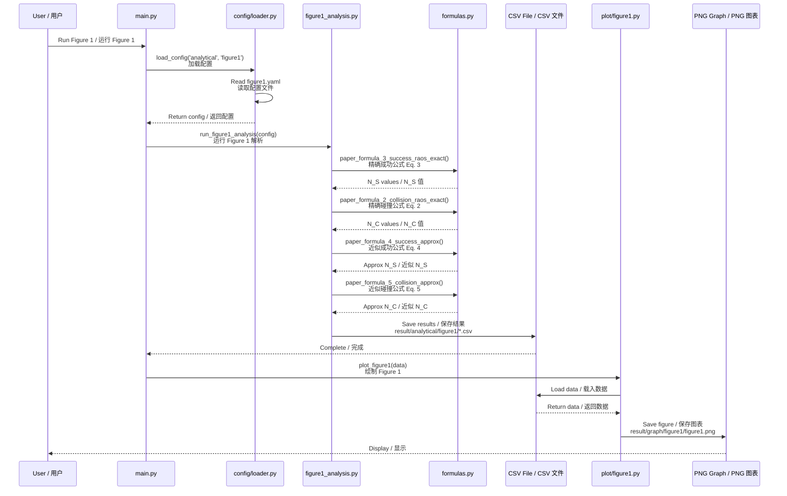

# Figure 1 Workflow / Figure 1 工作流程

This diagram shows the detailed execution flow for Figure 1 analysis and plotting.

本圖表顯示 Figure 1 分析和繪圖的詳細執行流程。

```mermaid
sequenceDiagram
    participant User as User / 用户
    participant Main as main.py
    participant Config as config/loader.py
    participant Fig1Analysis as figure1_analysis.py
    participant Formulas as formulas.py
    participant CSV as CSV File / CSV 文件
    participant Plot as plot/figure1.py
    participant PNG as PNG Graph / PNG 图表
    
    User->>Main: Run Figure 1 / 运行 Figure 1
    Main->>Config: load_config('analytical', 'figure1')<br/>加载配置
    Config->>Config: Read figure1.yaml<br/>读取配置文件
    Config-->>Main: Return config / 返回配置
    
    Main->>Fig1Analysis: run_figure1_analysis(config)<br/>运行 Figure 1 解析
    Fig1Analysis->>Formulas: paper_formula_3_success_raos_exact()<br/>精确成功公式 Eq. 3
    Formulas-->>Fig1Analysis: N_S values / N_S 值
    Fig1Analysis->>Formulas: paper_formula_2_collision_raos_exact()<br/>精确碰撞公式 Eq. 2
    Formulas-->>Fig1Analysis: N_C values / N_C 值
    Fig1Analysis->>Formulas: paper_formula_4_success_approx()<br/>近似成功公式 Eq. 4
    Formulas-->>Fig1Analysis: Approx N_S / 近似 N_S
    Fig1Analysis->>Formulas: paper_formula_5_collision_approx()<br/>近似碰撞公式 Eq. 5
    Formulas-->>Fig1Analysis: Approx N_C / 近似 N_C
    
    Fig1Analysis->>CSV: Save results / 保存结果<br/>result/analytical/figure1/*.csv
    CSV-->>Main: Complete / 完成
    
    Main->>Plot: plot_figure1(data)<br/>绘制 Figure 1
    Plot->>CSV: Load data / 载入数据
    CSV-->>Plot: Return data / 返回数据
    Plot->>PNG: Save figure / 保存图表<br/>result/graph/figure1/figure1.png
    PNG-->>User: Display / 显示
```

