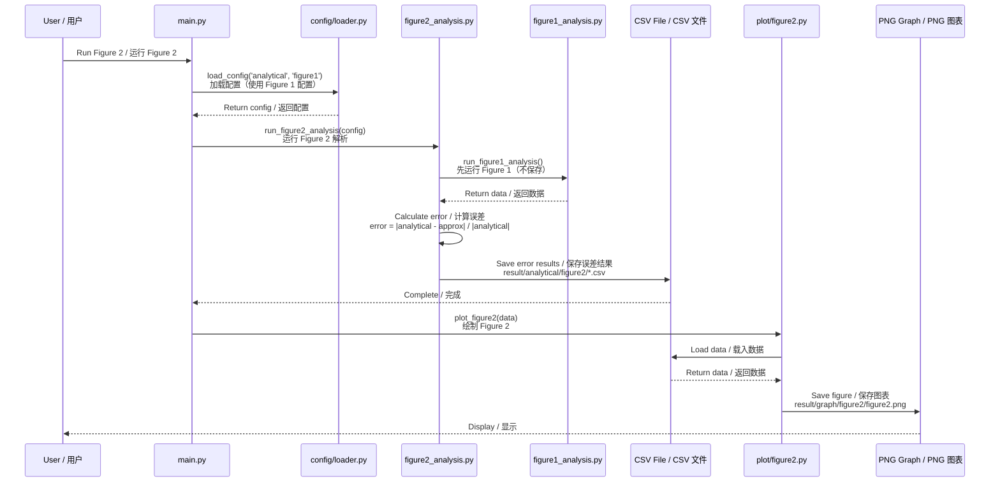

# Figure 2 Workflow / Figure 2 工作流程

This diagram shows the detailed execution flow for Figure 2 error analysis and plotting.

本圖表顯示 Figure 2 誤差分析和繪圖的詳細執行流程。

```mermaid
sequenceDiagram
    participant User as User / 用户
    participant Main as main.py
    participant Config as config/loader.py
    participant Fig2Analysis as figure2_analysis.py
    participant Fig1Analysis as figure1_analysis.py
    participant CSV as CSV File / CSV 文件
    participant Plot as plot/figure2.py
    participant PNG as PNG Graph / PNG 图表
    
    User->>Main: Run Figure 2 / 运行 Figure 2
    Main->>Config: load_config('analytical', 'figure1')<br/>加载配置（使用 Figure 1 配置）
    Config-->>Main: Return config / 返回配置
    
    Main->>Fig2Analysis: run_figure2_analysis(config)<br/>运行 Figure 2 解析
    Fig2Analysis->>Fig1Analysis: run_figure1_analysis()<br/>先运行 Figure 1（不保存）
    Fig1Analysis-->>Fig2Analysis: Return data / 返回数据
    
    Fig2Analysis->>Fig2Analysis: Calculate error / 计算误差<br/>error = |analytical - approx| / |analytical|
    Fig2Analysis->>CSV: Save error results / 保存误差结果<br/>result/analytical/figure2/*.csv
    CSV-->>Main: Complete / 完成
    
    Main->>Plot: plot_figure2(data)<br/>绘制 Figure 2
    Plot->>CSV: Load data / 载入数据
    CSV-->>Plot: Return data / 返回数据
    Plot->>PNG: Save figure / 保存图表<br/>result/graph/figure2/figure2.png
    PNG-->>User: Display / 显示
```

