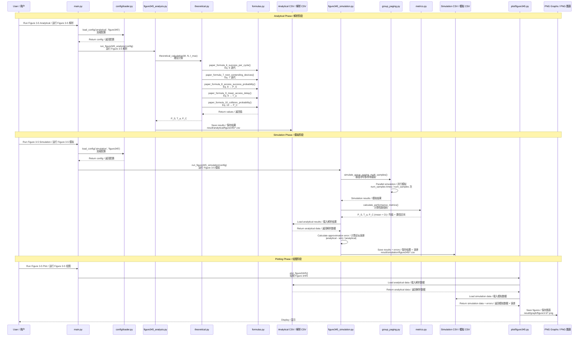

# Figure 3-5 Workflow / Figure 3-5 工作流程

This diagram shows the detailed execution flow for Figure 3-5 analysis, simulation, and plotting.

本圖表顯示 Figure 3-5 分析、模擬和繪圖的詳細執行流程。

```mermaid
sequenceDiagram
    participant User as User / 用户
    participant Main as main.py
    participant Config as config/loader.py
    participant Fig345Analysis as figure345_analysis.py
    participant Theoretical as theoretical.py
    participant Formulas as formulas.py
    participant CSVAnalytical as Analytical CSV / 解析 CSV
    participant Fig345Sim as figure345_simulation.py
    participant GroupPaging as group_paging.py
    participant Metrics as metrics.py
    participant CSVSimulation as Simulation CSV / 模拟 CSV
    participant Plot as plot/figure345.py
    participant PNG as PNG Graphs / PNG 图表
    
    Note over User,PNG: Analytical Phase / 解析阶段
    User->>Main: Run Figure 3-5 Analytical / 运行 Figure 3-5 解析
    Main->>Config: load_config('analytical', 'figure345')<br/>加载配置
    Config-->>Main: Return config / 返回配置
    
    Main->>Fig345Analysis: run_figure345_analysis(config)<br/>运行 Figure 3-5 解析
    Fig345Analysis->>Theoretical: theoretical_calculation(M, N, I_max)<br/>理论计算
    Theoretical->>Formulas: paper_formula_6_success_per_cycle()<br/>Eq. 6 迭代
    Theoretical->>Formulas: paper_formula_7_next_contending_devices()<br/>Eq. 7 迭代
    Theoretical->>Formulas: paper_formula_8_access_success_probability()<br/>Eq. 8 → P_S
    Theoretical->>Formulas: paper_formula_9_mean_access_delay()<br/>Eq. 9 → T_a
    Theoretical->>Formulas: paper_formula_10_collision_probability()<br/>Eq. 10 → P_C
    Formulas-->>Theoretical: Return values / 返回值
    Theoretical-->>Fig345Analysis: P_S, T_a, P_C
    Fig345Analysis->>CSVAnalytical: Save results / 保存结果<br/>result/analytical/figure345/*.csv
    
    Note over User,PNG: Simulation Phase / 模拟阶段
    User->>Main: Run Figure 3-5 Simulation / 运行 Figure 3-5 模拟
    Main->>Config: load_config('simulation', 'figure345')<br/>加载配置
    Config-->>Main: Return config / 返回配置
    
    Main->>Fig345Sim: run_figure345_simulation(config)<br/>运行 Figure 3-5 模拟
    Fig345Sim->>GroupPaging: simulate_group_paging_multi_samples()<br/>群组寻呼多样本模拟
    GroupPaging->>GroupPaging: Parallel simulation / 并行模拟<br/>num_samples times / num_samples 次
    GroupPaging-->>Fig345Sim: Simulation results / 模拟结果
    Fig345Sim->>Metrics: calculate_performance_metrics()<br/>计算性能指标
    Metrics-->>Fig345Sim: P_S, T_a, P_C (mean + CI) / 均值 + 置信区间
    
    Fig345Sim->>CSVAnalytical: Load analytical results / 载入解析结果
    CSVAnalytical-->>Fig345Sim: Return analytical data / 返回解析数据
    Fig345Sim->>Fig345Sim: Calculate approximation error / 计算近似误差<br/>|analytical - sim| / |analytical|
    Fig345Sim->>CSVSimulation: Save results + errors / 保存结果 + 误差<br/>result/simulation/figure345/*.csv
    
    Note over User,PNG: Plotting Phase / 绘图阶段
    User->>Main: Run Figure 3-5 Plot / 运行 Figure 3-5 绘图
    Main->>Plot: plot_figure3/4/5()<br/>绘制 Figure 3/4/5
    Plot->>CSVAnalytical: Load analytical data / 载入解析数据
    CSVAnalytical-->>Plot: Return analytical data / 返回解析数据
    Plot->>CSVSimulation: Load simulation data / 载入模拟数据
    CSVSimulation-->>Plot: Return simulation data + errors / 返回模拟数据 + 误差
    Plot->>PNG: Save figures / 保存图表<br/>result/graph/figure3-5/*.png
    PNG-->>User: Display / 显示
```

