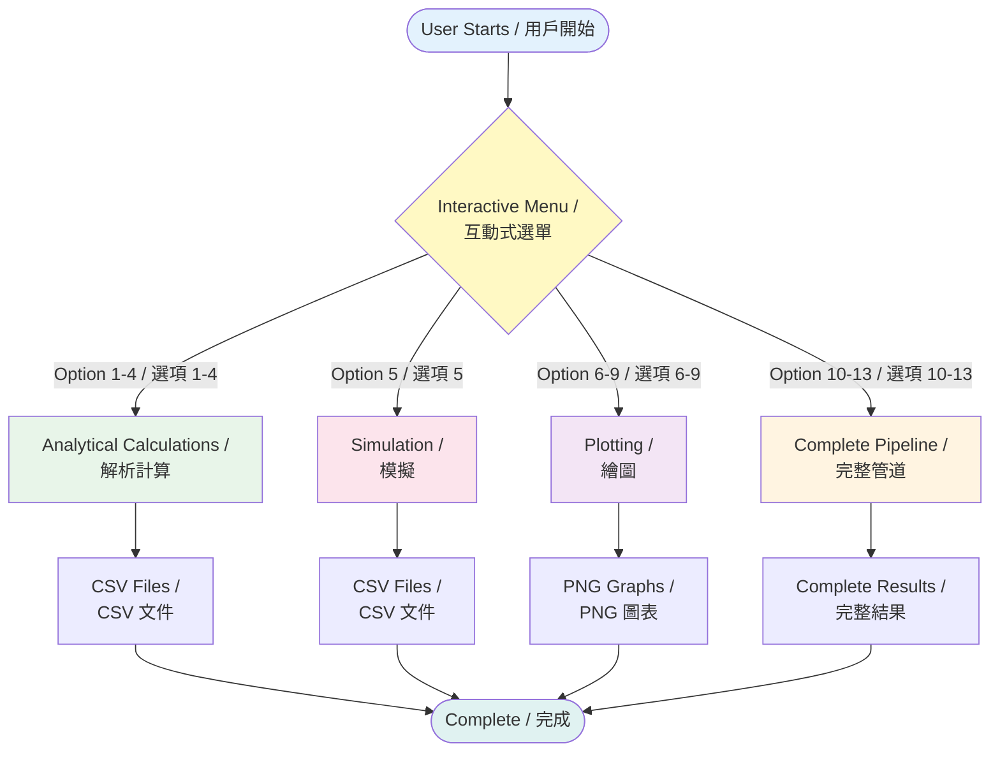

# Complete Pipeline Workflow / 完整管道工作流程

This diagram shows the high-level overview of the complete pipeline workflow.

本圖表顯示完整管道工作流程的高層次概覽。

For detailed workflows of each phase, see:
各階段的詳細工作流程請參見：

- [Analytical Phase Workflow](../phases/analytical_phase_workflow.md) - 解析階段工作流程
- [Simulation Phase Workflow](../phases/simulation_phase_workflow.md) - 模擬階段工作流程
- [Plotting Phase Workflow](../phases/plotting_phase_workflow.md) - 繪圖階段工作流程
- [Pipeline Phase Workflow](../phases/pipeline_phase_workflow.md) - 管道階段工作流程

