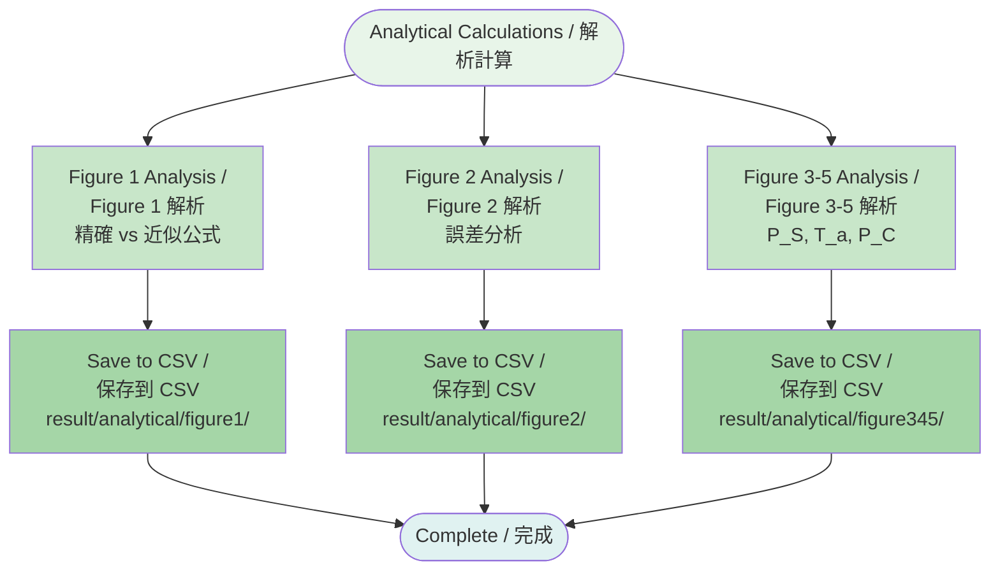

# Analytical Phase Workflow / 解析階段工作流程

This diagram shows the detailed workflow for the analytical calculation phase.

本圖表顯示解析計算階段的詳細工作流程。

```mermaid
flowchart TD
    Start([Analytical Calculations / 解析計算]) --> Fig1[Figure 1 Analysis /<br/>Figure 1 解析<br/>精確 vs 近似公式]
    Start --> Fig2[Figure 2 Analysis /<br/>Figure 2 解析<br/>誤差分析]
    Start --> Fig345[Figure 3-5 Analysis /<br/>Figure 3-5 解析<br/>P_S, T_a, P_C]
    
    Fig1 --> CSV1[Save to CSV /<br/>保存到 CSV<br/>result/analytical/figure1/]
    Fig2 --> CSV2[Save to CSV /<br/>保存到 CSV<br/>result/analytical/figure2/]
    Fig345 --> CSV3[Save to CSV /<br/>保存到 CSV<br/>result/analytical/figure345/]
    
    CSV1 --> End([Complete / 完成])
    CSV2 --> End
    CSV3 --> End
    
    style Start fill:#e8f5e9
    style Fig1 fill:#c8e6c9
    style Fig2 fill:#c8e6c9
    style Fig345 fill:#c8e6c9
    style CSV1 fill:#a5d6a7
    style CSV2 fill:#a5d6a7
    style CSV3 fill:#a5d6a7
    style End fill:#e0f2f1
```

