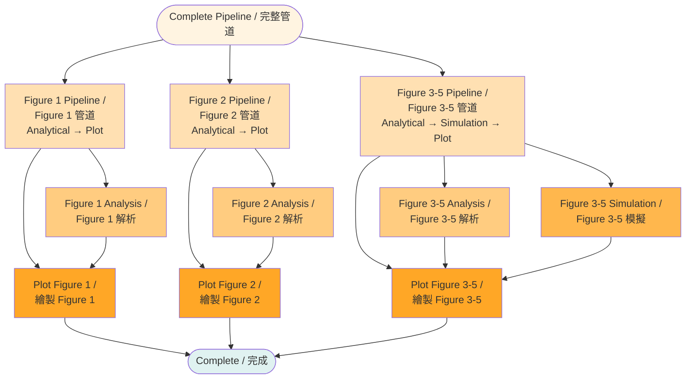

# Pipeline Phase Workflow / 管道階段工作流程

This diagram shows the detailed workflow for the complete pipeline phase, which combines analytical, simulation, and plotting phases.

本圖表顯示完整管道階段的詳細工作流程，該階段結合了解析、模擬和繪圖階段。

