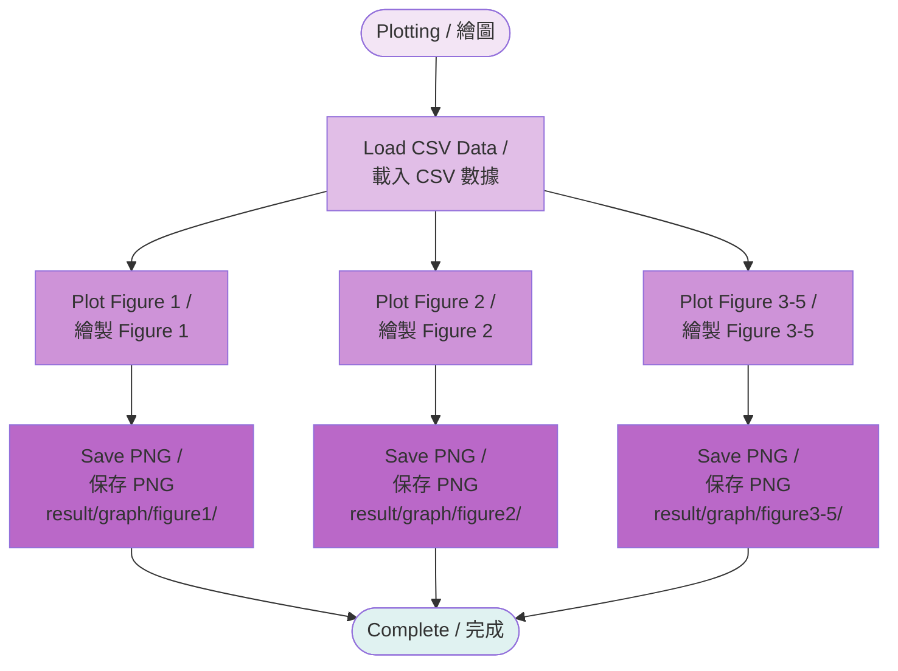

# Plotting Phase Workflow / 繪圖階段工作流程

This diagram shows the detailed workflow for the plotting phase.

本圖表顯示繪圖階段的詳細工作流程。

```mermaid
flowchart TD
    Start([Plotting / 繪圖]) --> LoadCSV[Load CSV Data /<br/>載入 CSV 數據]
    
    LoadCSV --> Plot1[Plot Figure 1 /<br/>繪製 Figure 1]
    LoadCSV --> Plot2[Plot Figure 2 /<br/>繪製 Figure 2]
    LoadCSV --> Plot345[Plot Figure 3-5 /<br/>繪製 Figure 3-5]
    
    Plot1 --> PNG1[Save PNG /<br/>保存 PNG<br/>result/graph/figure1/]
    Plot2 --> PNG2[Save PNG /<br/>保存 PNG<br/>result/graph/figure2/]
    Plot345 --> PNG345[Save PNG /<br/>保存 PNG<br/>result/graph/figure3-5/]
    
    PNG1 --> End([Complete / 完成])
    PNG2 --> End
    PNG345 --> End
    
    style Start fill:#f3e5f5
    style LoadCSV fill:#e1bee7
    style Plot1 fill:#ce93d8
    style Plot2 fill:#ce93d8
    style Plot345 fill:#ce93d8
    style PNG1 fill:#ba68c8
    style PNG2 fill:#ba68c8
    style PNG345 fill:#ba68c8
    style End fill:#e0f2f1
```

