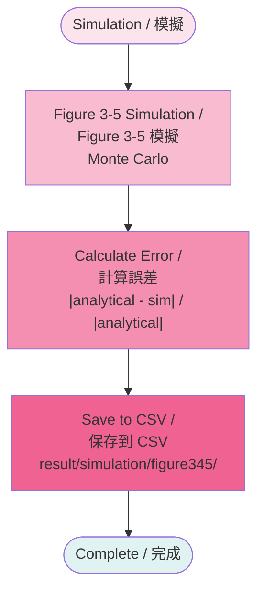

# Simulation Phase Workflow / 模擬階段工作流程

This diagram shows the detailed workflow for the simulation phase.

本圖表顯示模擬階段的詳細工作流程。

```mermaid
flowchart TD
    Start([Simulation / 模擬]) --> Fig345Sim[Figure 3-5 Simulation /<br/>Figure 3-5 模擬<br/>Monte Carlo]
    
    Fig345Sim --> ErrorCalc["Calculate Error /<br/>計算誤差<br/>|analytical - sim| / |analytical|"]
    
    ErrorCalc --> CSV4[Save to CSV /<br/>保存到 CSV<br/>result/simulation/figure345/]
    
    CSV4 --> End([Complete / 完成])
    
    style Start fill:#fce4ec
    style Fig345Sim fill:#f8bbd0
    style ErrorCalc fill:#f48fb1
    style CSV4 fill:#f06292
    style End fill:#e0f2f1
```

