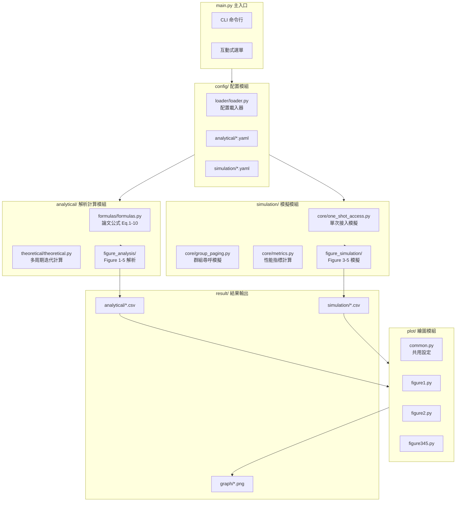
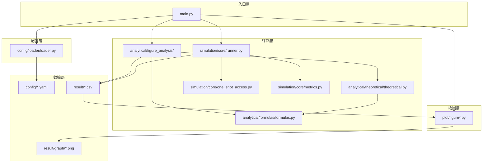
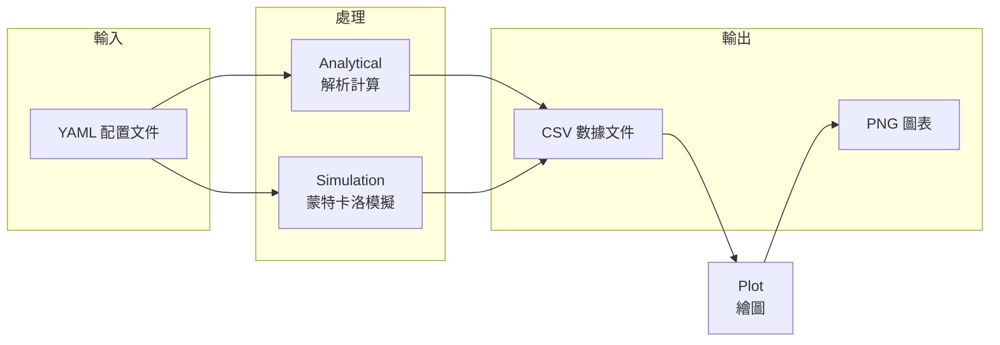

# 系統架構與模組說明

本文檔詳細說明項目的整體架構、模組職責和依賴關係。

---

## 整體架構圖



---

## 模組職責說明

| 模組            | 職責                      | 輸入          | 輸出        |
| --------------- | ------------------------- | ------------- | ----------- |
| **config/**     | 載入和管理 YAML 配置      | YAML 文件路徑 | Python 字典 |
| **analytical/** | 論文公式計算（精確+近似） | 配置參數      | CSV 文件    |
| **simulation/** | 蒙特卡洛隨機模擬          | 配置參數      | CSV 文件    |
| **plot/**       | 讀取 CSV 並繪製圖表       | CSV 文件      | PNG 圖片    |

---

## 項目結構

```
FYP-1-One-Shot-Random-Access-New-Architecture/
│
├── main.py                        # 🎯 主程式入口
│
├── config/                        # ⚙️ 配置文件模組
│   ├── loader/                   #    配置載入器
│   │   └── loader.py             #    load_config(), get_config_path()
│   └── analytical/               #    解析計算配置
│       ├── figure1.yaml          #    Figure 1 & 2 配置
│       └── figure345.yaml        #    Figure 3-5 配置
│
├── analytical/                    # 📐 解析計算模組
│   ├── formulas/                 #    論文公式實現 (Eq.1-10)
│   ├── theoretical/              #    多周期迭代計算
│   └── figure_analysis/          #    各圖表解析計算
│
├── simulation/                    # 🔬 模擬模組
│   ├── simulation_figure345.py   #    Figure 3-5 模擬入口
│   ├── config/                   #    模擬配置
│   └── core/                     #    核心模擬引擎
│
├── plot/                          # 📊 繪圖模組
│   ├── common.py                 #    matplotlib 配置
│   ├── figure1.py                #    Figure 1 繪圖
│   ├── figure2.py                #    Figure 2 繪圖
│   └── figure345.py              #    Figure 3-5 繪圖
│
├── result/                        # 📁 結果輸出 (運行時自動創建)
│   ├── analytical/               #    解析結果
│   ├── simulation/               #    模擬結果
│   └── graph/                    #    圖表輸出
│
└── docs/                          # 📚 文檔
```

---

## 各模組功能詳解

### 1. config/ 模組

| 文件                        | 功能                | 主要函數/內容                              |
| --------------------------- | ------------------- | ------------------------------------------ |
| `loader/loader.py`          | 配置載入器          | `load_config(type, name)` - 載入 YAML 配置 |
| `analytical/figure1.yaml`   | Figure 1&2 配置     | n_values, m_over_n_max, m_start, n_jobs    |
| `analytical/figure345.yaml` | Figure 3-5 解析配置 | M, I_max, N_start, N_stop, N_step          |

### 2. analytical/ 模組

| 文件                                    | 功能             | 輸入              | 輸出                    |
| --------------------------------------- | ---------------- | ----------------- | ----------------------- |
| `formulas/formulas.py`                  | 論文公式 Eq.1-10 | M, N, 參數        | 計算結果                |
| `theoretical/theoretical.py`            | 多周期迭代       | M, N, I_max       | P_S, T_a, P_C, N_s_list |
| `figure_analysis/figure1_analysis.py`   | Figure 1 計算    | config            | CSV 文件                |
| `figure_analysis/figure2_analysis.py`   | Figure 2 誤差    | config, fig1_data | CSV 文件                |
| `figure_analysis/figure345_analysis.py` | Figure 3-5 解析  | config            | CSV 文件                |

### 3. simulation/ 模組

| 文件                               | 功能                                  | 輸入          | 輸出          |
| ---------------------------------- | ------------------------------------- | ------------- | ------------- |
| `simulation_figure345.py`          | Figure 3-5 模擬入口                   | YAML 配置     | CSV 文件      |
| `core/one_shot_access.py`          | 所有模擬函數（單 AC / 單樣本 / 批量） | M, N, I_max   | P_S, T_a, P_C |
| `core/runner.py`                   | 並行執行器                            | Config        | CSV 文件      |
| `core/metrics.py`                  | 統計計算                              | results_array | mean, CI      |
| `config/simulation_figure345.yaml` | 論文參數配置 (N=5-45, 10^7 樣本)      | -             | -             |

> **⚡ Batch Optimization**: 使用分塊處理策略大幅減少 IPC 開銷，10^7 樣本約 4 分鐘完成

### 4. plot/ 模組

| 文件           | 功能            | 輸入     | 輸出     |
| -------------- | --------------- | -------- | -------- |
| `common.py`    | matplotlib 配置 | -        | -        |
| `figure1.py`   | Figure 1 繪圖   | CSV 數據 | PNG 圖片 |
| `figure2.py`   | Figure 2 繪圖   | CSV 數據 | PNG 圖片 |
| `figure345.py` | Figure 3-5 繪圖 | CSV 數據 | PNG 圖片 |

---

## 模組依賴關係圖



---

## 數據流



---

[← 返回 README](../../README.md) | [配置說明 →](CONFIGURATION.md)
