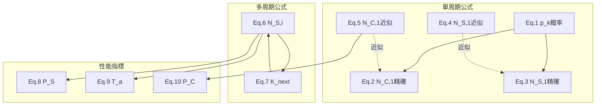

# 論文公式對應與解釋

本文檔詳細說明論文中的數學公式及其在代碼中的實現。

---

## 論文背景

### 論文信息

- **標題**: Modeling and Estimation of One-Shot Random Access for Finite-User Multichannel Slotted ALOHA Systems
- **作者**: Chia-Hung Wei, Ray-Guang Cheng, Shiao-Li Tsao
- **關鍵詞**: 機器類型通信（MTC）、群組尋呼（Group Paging）、隨機接入

### 研究問題

在 3GPP LTE 網絡中，當大量 MTC 設備（如智慧電表、傳感器）同時被激活時，會導致：

- 🚨 網絡擁塞
- ⏰ 接入延遲增加
- 📉 傳輸成功率下降

### 論文解決方案

提出了一套**數學模型**來預測：

- **P_S** (Access Success Probability)：設備成功接入的概率
- **T_a** (Mean Access Delay)：平均接入延遲（以接入周期為單位）
- **P_C** (Collision Probability)：RAO 發生碰撞的概率

---

## 核心概念與術語

### 系統參數

| 符號      | 名稱                | 說明                          | 典型值  |
| --------- | ------------------- | ----------------------------- | ------- |
| **M**     | 設備總數            | 嘗試接入的設備數量            | 100     |
| **N**     | RAO 數量            | 每個接入周期的隨機接入機會數  | 5-45    |
| **I_max** | 最大周期數          | 設備最多嘗試的接入周期數      | 10      |
| **K_i**   | 第 i 周期競爭設備數 | 在第 i 個周期嘗試接入的設備數 | K_1 = M |

### RAO (Random Access Opportunity)

- **中文**: 隨機接入機會
- **解釋**: 基站在每個接入周期提供的「通道」，設備隨機選擇一個 RAO 發送接入請求
- **類比**: 就像超市的 N 個收銀台，每個顧客隨機選擇一個排隊

### AC (Access Cycle)

- **中文**: 接入周期
- **解釋**: 一次完整的接入嘗試過程，失敗的設備會在下一個 AC 重試
- **類比**: 就像抽獎的「一輪」，沒中獎的下一輪再抽

### 接入結果分類

```
┌─────────────────────────────────────────────────────┐
│                    一個接入周期                      │
├─────────────────────────────────────────────────────┤
│  RAO 1: 設備 A          → 成功 (只有 1 個設備)      │
│  RAO 2: 設備 B, C, D    → 碰撞 (多個設備)          │
│  RAO 3: 無設備          → 空閒                     │
│  RAO 4: 設備 E          → 成功                     │
│  RAO 5: 設備 F, G       → 碰撞                     │
├─────────────────────────────────────────────────────┤
│  N_S = 2 (成功 RAO 數)                              │
│  N_C = 2 (碰撞 RAO 數)                              │
│  N_I = 1 (空閒 RAO 數)                              │
└─────────────────────────────────────────────────────┘
```

---

## 公式列表

| 公式  | 函數名                                       | 數學表達式                            | 用途            |
| ----- | -------------------------------------------- | ------------------------------------- | --------------- |
| Eq.1  | `paper_formula_1_pk_probability`             | P(k 個 RAO 碰撞)                      | 基礎概率        |
| Eq.2  | `paper_formula_2_collision_raos_exact`       | N_C,1 = Σ k × p_k                     | 精確碰撞 RAO 數 |
| Eq.3  | `paper_formula_3_success_raos_exact`         | N_S,1 = E[成功 RAO]                   | 精確成功 RAO 數 |
| Eq.4  | `paper_formula_4_success_approx`             | N_S,1 ≈ M × exp(-M/N)                 | 近似成功 RAO 數 |
| Eq.5  | `paper_formula_5_collision_approx`           | N_C,1 ≈ N × (1 - exp(-M/N) × (1+M/N)) | 近似碰撞 RAO 數 |
| Eq.6  | `paper_formula_6_success_per_cycle`          | N_S,i = K_i × exp(-K_i/N)             | 第 i 周期成功數 |
| Eq.7  | `paper_formula_7_next_contending_devices`    | K_next = K_i × (1 - exp(-K_i/N))      | 下周期競爭數    |
| Eq.8  | `paper_formula_8_access_success_probability` | P_S = Σ N_S,i / M                     | 接入成功概率    |
| Eq.9  | `paper_formula_9_mean_access_delay`          | T_a = Σ(i×N_S,i) / Σ N_S,i            | 平均延遲        |
| Eq.10 | `paper_formula_10_collision_probability`     | P_C = Σ N_C,i / (I_max × N)           | 碰撞概率        |

---

## 公式依賴關係圖



---

## 公式分類

| 分類     | 公式    | 使用場景               |
| -------- | ------- | ---------------------- |
| 精確公式 | Eq.1-3  | Figure 1（理論驗證）   |
| 近似公式 | Eq.4-5  | Figure 1-2（快速計算） |
| 迭代公式 | Eq.6-7  | Figure 3-5（多周期）   |
| 指標公式 | Eq.8-10 | Figure 3-5（性能評估） |

---

## 性能指標

| 指標    | 公式                   | 意義                     |
| ------- | ---------------------- | ------------------------ |
| **P_S** | Σ N_S,i / M            | 設備成功接入的比例       |
| **T_a** | Σ(i × N_S,i) / Σ N_S,i | 成功設備的平均等待周期數 |
| **P_C** | Σ N_C,i / (I_max × N)  | RAO 發生碰撞的比例       |

---

## 本項目復現的圖表

| 圖表     | 內容                       | X 軸 | Y 軸               |
| -------- | -------------------------- | ---- | ------------------ |
| Figure 1 | 單周期精確公式 vs 近似公式 | M/N  | N_S,1/N 和 N_C,1/N |
| Figure 2 | 近似公式的誤差分析         | M/N  | 誤差百分比 (%)     |
| Figure 3 | 接入成功概率               | N    | P_S                |
| Figure 4 | 平均接入延遲               | N    | T_a                |
| Figure 5 | 碰撞概率                   | N    | P_C                |

---

[← 返回 README](../../README.md) | [配置說明 →](CONFIGURATION.md)
