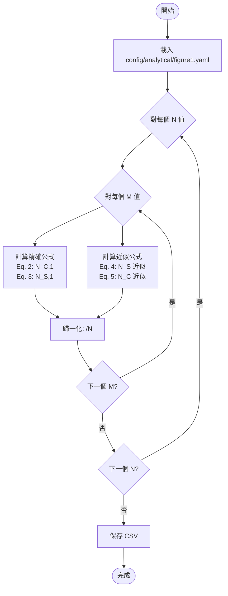
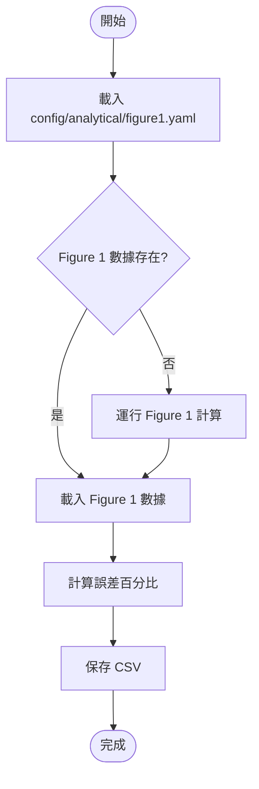
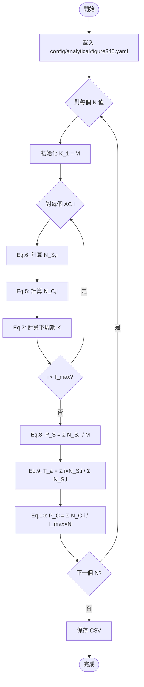
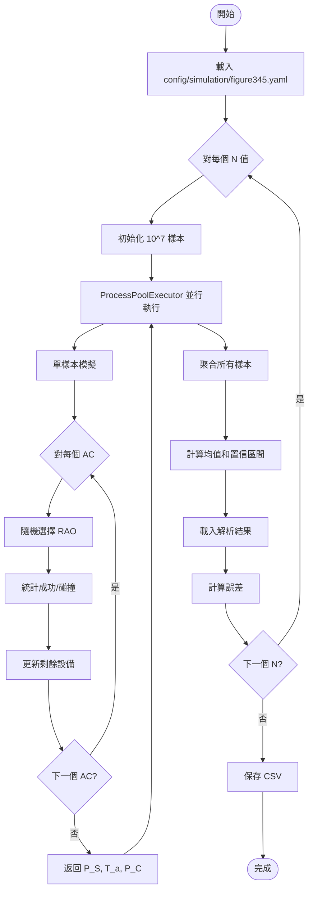

# 功能選項完整說明

本文檔詳細說明所有 13 個功能選項的用法、執行流程和輸出。

---

## 選項總覽

| 選項 | 類型 | 功能                   | 耗時          | 依賴           |
| ---- | ---- | ---------------------- | ------------- | -------------- |
| 1    | 解析 | Figure 1 精確+近似公式 | ~1-2 分鐘     | 無             |
| 2    | 解析 | Figure 2 誤差分析      | ~1-2 分鐘     | 選項 1         |
| 3    | 解析 | Figure 3-5 解析        | ~5 秒         | 無             |
| 4    | 解析 | 運行所有解析           | ~2-4 分鐘     | 無             |
| 5    | 模擬 | Figure 3-5 模擬        | ~100-120 分鐘 | 選項 3（可選） |
| 6    | 繪圖 | 繪製 Figure 1          | ~1 秒         | 選項 1         |
| 7    | 繪圖 | 繪製 Figure 2          | ~1 秒         | 選項 2         |
| 8    | 繪圖 | 繪製 Figure 3-5        | ~1 秒         | 選項 3, 5      |
| 9    | 繪圖 | 繪製所有圖表           | ~1 秒         | 選項 1-5       |
| 10   | 流程 | Figure 1 完整          | ~1-2 分鐘     | 無             |
| 11   | 流程 | Figure 2 完整          | ~1-2 分鐘     | 無             |
| 12   | 流程 | Figure 3-5 完整        | ~100-120 分鐘 | 無             |
| 13   | 流程 | 所有完整               | ~105-125 分鐘 | 無             |

---

## 解析計算選項

### 【選項 1】Figure 1 解析計算

#### 功能說明

計算單個接入周期（One-Shot）的期望成功 RAO 數和碰撞 RAO 數：

- **精確公式**: 使用組合數學（Eq. 1-3）
- **近似公式**: 使用泊松近似（Eq. 4-5）

#### 執行流程



#### 輸入參數

| 參數         | 來源         | 說明       | 默認值    |
| ------------ | ------------ | ---------- | --------- |
| n_values     | figure1.yaml | N 值列表   | [3, 14]   |
| m_over_n_max | figure1.yaml | M/N 最大值 | 10        |
| m_start      | figure1.yaml | M 起始值   | 1         |
| n_jobs       | figure1.yaml | 並行核心數 | -1 (全部) |

#### 輸出文件

**路徑**: `result/analytical/figure1/{timestamp}/figure1_N{n}.csv`

| 欄位           | 類型  | 說明             |
| -------------- | ----- | ---------------- |
| M              | int   | 設備數           |
| M/N            | float | M/N 比值         |
| analytical_N_S | float | 精確公式 N_S,1/N |
| analytical_N_C | float | 精確公式 N_C,1/N |
| approx_N_S     | float | 近似公式 N_S,1/N |
| approx_N_C     | float | 近似公式 N_C,1/N |

#### 使用範例

```bash
# 互動式
uv run python main.py  # 輸入 1

# CLI
uv run python main.py analytical figure1
```

---

### 【選項 2】Figure 2 解析計算

#### 功能說明

計算近似公式相對於精確公式的誤差百分比：

```
誤差 = |精確值 - 近似值| / |精確值| × 100%
```

#### 執行流程



#### 輸出文件

**路徑**: `result/analytical/figure2/{timestamp}/figure2_N{n}.csv`

| 欄位           | 類型  | 說明             |
| -------------- | ----- | ---------------- |
| M              | int   | 設備數           |
| M/N            | float | M/N 比值         |
| analytical_N_S | float | 精確公式 N_S,1/N |
| analytical_N_C | float | 精確公式 N_C,1/N |
| approx_N_S     | float | 近似公式 N_S,1/N |
| approx_N_C     | float | 近似公式 N_C,1/N |
| N_S_error(%)   | float | N_S 誤差百分比   |
| N_C_error(%)   | float | N_C 誤差百分比   |

---

### 【選項 3】Figure 3, 4, 5 合併解析計算

#### 功能說明

使用多周期迭代公式（Eq. 6-10）計算三個性能指標：

- **P_S**: 接入成功概率
- **T_a**: 平均接入延遲
- **P_C**: 碰撞概率

#### 執行流程



#### 輸入參數

| 參數    | 來源           | 說明       | 默認值 |
| ------- | -------------- | ---------- | ------ |
| M       | figure345.yaml | 設備總數   | 100    |
| I_max   | figure345.yaml | 最大周期數 | 10     |
| N_start | figure345.yaml | N 起始值   | 5      |
| N_stop  | figure345.yaml | N 結束值   | 46     |
| N_step  | figure345.yaml | N 步長     | 1      |

#### 輸出文件

**路徑**: `result/analytical/figure345/{timestamp}/figure345_analytical.csv`

| 欄位  | 類型  | 說明         |
| ----- | ----- | ------------ |
| N     | int   | RAO 數量     |
| P_S   | float | 接入成功概率 |
| T_a   | float | 平均接入延遲 |
| P_C   | float | 碰撞概率     |
| M     | int   | 設備總數     |
| I_max | int   | 最大周期數   |

---

### 【選項 4】運行所有解析計算

依序執行選項 1 → 2 → 3，並優化數據傳遞避免重複計算。

---

## 模擬選項

### 【選項 5】Figure 3, 4, 5 合併模擬

#### 功能說明

使用蒙特卡洛模擬驗證理論公式：

- 執行 10^7 次隨機模擬
- 使用多進程並行加速
- 計算與理論值的誤差

#### 執行流程



#### 輸入參數

| 參數        | 來源           | 說明       | 默認值        |
| ----------- | -------------- | ---------- | ------------- |
| M           | figure345.yaml | 設備總數   | 100           |
| I_max       | figure345.yaml | 最大周期數 | 10            |
| N range     | figure345.yaml | N 範圍     | 5-45, 步長 1  |
| num_samples | figure345.yaml | 樣本數     | 10,000,000    |
| num_workers | figure345.yaml | 進程數     | -1 (全部核心) |

#### 輸出文件

**路徑**: `result/simulation/figure345/{timestamp}/figure345_simulation.csv`

| 欄位      | 類型  | 說明             |
| --------- | ----- | ---------------- |
| N         | int   | RAO 數量         |
| P_S       | float | 模擬接入成功概率 |
| T_a       | float | 模擬平均接入延遲 |
| P_C       | float | 模擬碰撞概率     |
| P_S_error | float | P_S 誤差百分比   |
| T_a_error | float | T_a 誤差百分比   |
| P_C_error | float | P_C 誤差百分比   |
| M         | int   | 設備總數         |
| I_max     | int   | 最大周期數       |

#### 性能說明

- **吞吐量**: ~70,000-74,000 樣本/秒
- **單個 N 值耗時**: ~140 秒
- **全部 41 個 N 值**: ~95-100 分鐘

---

## 繪圖選項

### 【選項 6】繪製 Figure 1


**輸出**: 包含 4 個子圖的圖表
- (a) N=3 解析結果
- (b) N=14 解析結果
- (c) 近似公式結果
- (d) 全部合併

### 【選項 7】繪製 Figure 2

**輸出**: 誤差分析圖（Y 軸對數刻度）

### 【選項 8】繪製 Figure 3, 4, 5

**輸出**: 三張獨立圖表
- 左 Y 軸: 性能指標（藍色）
- 右 Y 軸: 近似誤差（綠色）
- 實線: 理論曲線
- 空心圓: 模擬結果

### 【選項 9】繪製所有圖表

依序執行選項 6 → 7 → 8

---

## 完整流程選項

| 選項 | 流程                           |
| ---- | ------------------------------ |
| 10   | Figure 1: 解析 → 繪圖          |
| 11   | Figure 2: 解析 → 繪圖          |
| 12   | Figure 3-5: 解析 → 模擬 → 繪圖 |
| 13   | 全部: 選項 10 → 11 → 12        |

---

[← 返回 README](../../README.md) | [輸出說明 →](OUTPUT_GUIDE.md)
