# Main Workflow Documentation

本文档描述从 `main.py` 开始的每个菜单选项的完整执行流程，包括所有调用的文件和模块。

## 入口点

**文件**: `main.py`

- **函数**: `main()` → `interactive_menu()` 或 CLI 命令处理
- **作用**: 系统主入口，提供交互式菜单和命令行接口

---

## 菜单选项执行流程

### 【解析计算 (Analytical)】

#### 选项 1: Figure 1 - NS,1/N & NC,1/N 精确公式 + 近似公式

**执行流程图**:

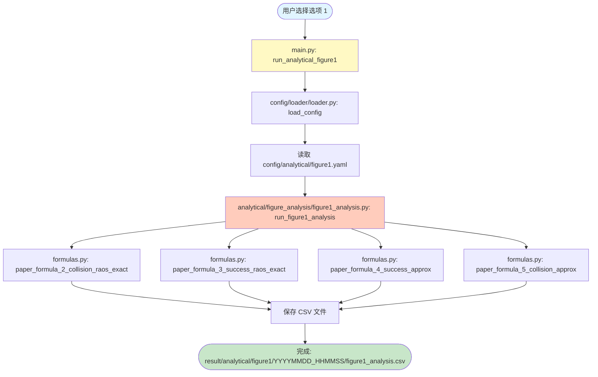

**文件调用树**:

```text
main.py
└── run_analytical_figure1()
    ├── config/loader/loader.py
    │   └── load_config('analytical', 'figure1')
    │       └── 读取: config/analytical/figure1.yaml
    └── analytical/figure_analysis/figure1_analysis.py
        └── run_figure1_analysis(config)
            ├── analytical/formulas/formulas.py
            │   ├── paper_formula_2_collision_raos_exact()  [精确公式]
            │   ├── paper_formula_3_success_raos_exact()    [精确公式]
            │   ├── paper_formula_4_success_approx()        [近似公式]
            │   └── paper_formula_5_collision_approx()      [近似公式]
            └── 保存结果到: result/analytical/figure1/YYYYMMDD_HHMMSS/figure1_analysis.csv
```

**调用的文件**:

- `main.py` (line 141-144)
- `config/loader/loader.py` - 加载配置
- `config/analytical/figure1.yaml` - 配置文件
- `analytical/figure_analysis/figure1_analysis.py` - 主要计算逻辑
- `analytical/formulas/formulas.py` - 公式实现

**输出文件**:

- `result/analytical/figure1/YYYYMMDD_HHMMSS/figure1_analysis.csv`

---

#### 选项 2: Figure 2 - 近似误差分析（精确 vs 近似）

**执行流程图**:

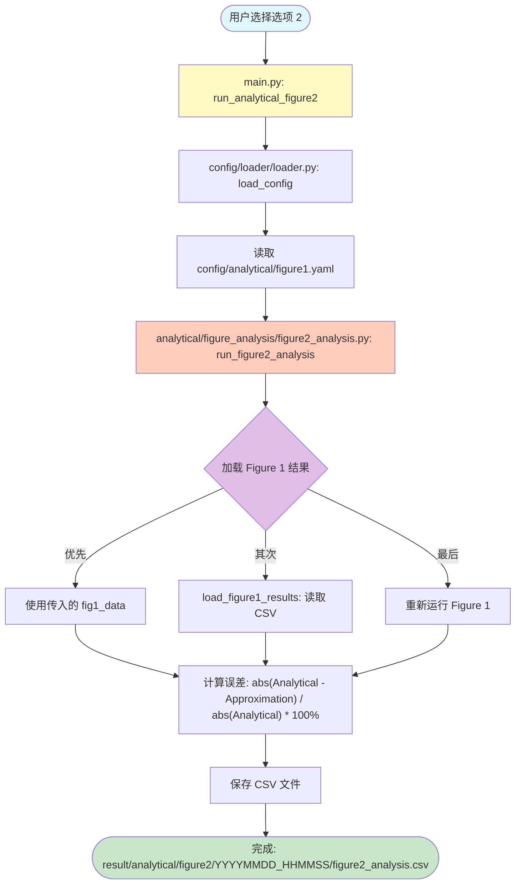

**文件调用树**:

```text
main.py
└── run_analytical_figure2()
    ├── config/loader/loader.py
    │   └── load_config('analytical', 'figure1')  [使用 Figure 1 配置]
    │       └── 读取: config/analytical/figure1.yaml
    └── analytical/figure_analysis/figure2_analysis.py
        └── run_figure2_analysis(config)
            ├── analytical/figure_analysis/figure1_analysis.py
            │   └── load_figure1_results()
            │       └── 读取: result/analytical/figure1/最新时间戳/figure1_analysis.csv
            ├── 计算误差: |Analytical - Approximation| / |Analytical| * 100%
            └── 保存结果到: result/analytical/figure2/YYYYMMDD_HHMMSS/figure2_analysis.csv
```

**调用的文件**:

- `main.py` (line 147-153)
- `config/loader/loader.py` - 加载配置
- `config/analytical/figure1.yaml` - 配置文件
- `analytical/figure_analysis/figure2_analysis.py` - 主要计算逻辑
- `analytical/figure_analysis/figure1_analysis.py` - 加载 Figure 1 数据

**输出文件**:

- `result/analytical/figure2/YYYYMMDD_HHMMSS/figure2_analysis.csv`

---

#### 选项 3: Figure 3, 4, 5 合并解析 (P_S, T_a, P_C)

**执行流程图**:

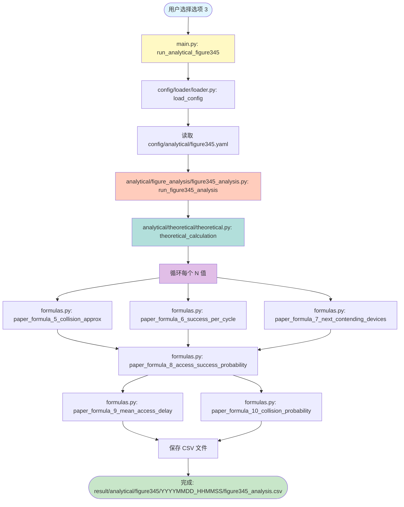

**文件调用树**:

```text
main.py
└── run_analytical_figure345()
    ├── config/loader/loader.py
    │   └── load_config('analytical', 'figure345')
    │       └── 读取: config/analytical/figure345.yaml
    └── analytical/figure_analysis/figure345_analysis.py
        └── run_figure345_analysis(config)
            └── analytical/theoretical/theoretical.py
                └── theoretical_calculation(M, N, I_max)
                    └── analytical/formulas/formulas.py
                        ├── paper_formula_5_collision_approx()   [Eq. 5]
                        ├── paper_formula_6_success_per_cycle()   [Eq. 6]
                        ├── paper_formula_7_next_contending_devices() [Eq. 7]
                        ├── paper_formula_8_access_success_probability() [Eq. 8]
                        ├── paper_formula_9_mean_access_delay()  [Eq. 9]
                        └── paper_formula_10_collision_probability() [Eq. 10]
            └── 保存结果到: result/analytical/figure345/YYYYMMDD_HHMMSS/figure345_analysis.csv
```

**调用的文件**:

- `main.py` (line 156-159)
- `config/loader/loader.py` - 加载配置
- `config/analytical/figure345.yaml` - 配置文件
- `analytical/figure_analysis/figure345_analysis.py` - 主要计算逻辑
- `analytical/theoretical/theoretical.py` - 理论计算
- `analytical/formulas/formulas.py` - 公式实现 (Eq. 5-10)

**输出文件**:

- `result/analytical/figure345/YYYYMMDD_HHMMSS/figure345_analysis.csv`

---

#### 选项 4: 运行所有解析计算

**执行流程图**:

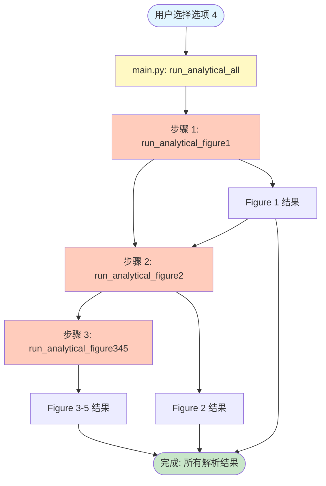

**文件调用树**:

```text
main.py
└── run_analytical_all()
    ├── [1] run_analytical_figure1()  [见选项 1]
    │   └── ... (选项 1 的所有调用)
    ├── [2] run_analytical_figure2(config, fig1_data=fig1_data)  [见选项 2，传入 Figure 1 结果]
    │   └── ... (选项 2 的所有调用)
    └── [3] run_analytical_figure345()  [见选项 3]
        └── ... (选项 3 的所有调用)
```

**调用的文件**:

- `main.py` (line 162-179)
- 所有选项 1、2、3 调用的文件

**输出文件**:

- 选项 1、2、3 的所有输出文件

---

### 【模拟 (Simulation)】

#### 选项 5: Figure 3, 4, 5 合并模拟 (P_S, T_a, P_C)

**执行流程图**:

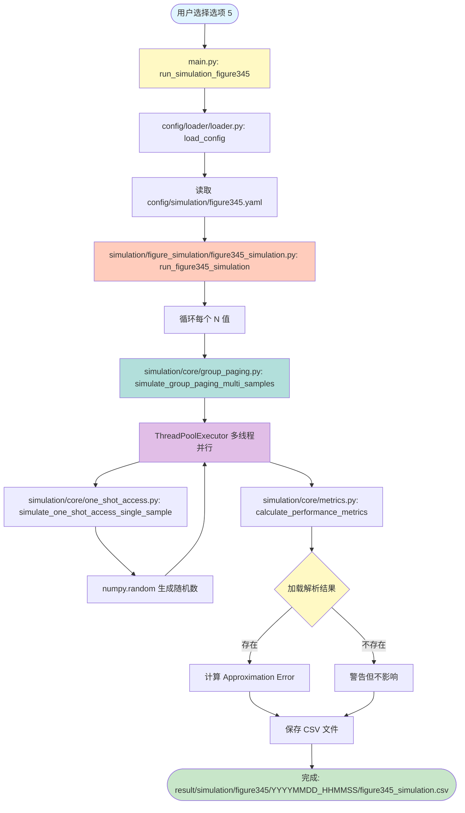

**文件调用树**:

```text
main.py
└── run_simulation_figure345()
    ├── config/loader/loader.py
    │   └── load_config('simulation', 'figure345')
    │       └── 读取: config/simulation/figure345.yaml
    └── simulation/figure_simulation/figure345_simulation.py
        └── run_figure345_simulation(config)
            ├── simulation/core/group_paging.py
            │   └── simulate_group_paging_multi_samples(M, N, I_max, num_samples, num_workers)
            │       ├── ThreadPoolExecutor 多线程并行执行
            │       └── simulation/core/one_shot_access.py
            │           └── simulate_one_shot_access_single_sample()
            │               └── numpy.random 生成随机数
            ├── simulation/core/metrics.py
            │   └── calculate_performance_metrics(results_array)
            │       └── 计算 P_S, T_a, P_C 的均值和置信区间
            ├── analytical/figure_analysis/figure345_analysis.py
            │   └── load_figure345_results()  [加载解析结果]
            │       └── 读取: result/analytical/figure345/最新时间戳/figure345_analysis.csv
            ├── 计算 Approximation Error: |Approximation - Simulation| / |Approximation| * 100%
            └── 保存结果到: result/simulation/figure345/YYYYMMDD_HHMMSS/figure345_simulation.csv
```

**调用的文件**:

- `main.py` (line 187-190)
- `config/loader/loader.py` - 加载配置
- `config/simulation/figure345.yaml` - 配置文件
- `simulation/figure_simulation/figure345_simulation.py` - 模拟协调层
- `simulation/core/group_paging.py` - 群组寻呼模拟引擎
- `simulation/core/one_shot_access.py` - 单次接入模拟
- `simulation/core/metrics.py` - 性能指标计算
- `analytical/figure_analysis/figure345_analysis.py` - 加载解析结果

**输出文件**:

- `result/simulation/figure345/YYYYMMDD_HHMMSS/figure345_simulation.csv`

---

### 【绘图 (Plot)】

#### 选项 6: 绘制 Figure 1

**执行流程图**:

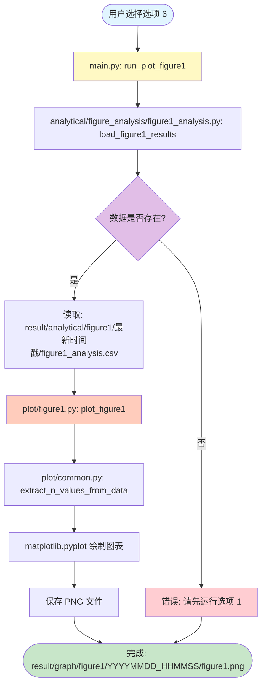

**文件调用树**:

```text
main.py
└── run_plot_figure1()
    ├── analytical/figure_analysis/figure1_analysis.py
    │   └── load_figure1_results()
    │       └── 读取: result/analytical/figure1/最新时间戳/figure1_analysis.csv
    └── plot/figure1.py
        └── plot_figure1(data, save_path, show)
            ├── plot/common.py
            │   └── extract_n_values_from_data()  [提取 N 值]
            └── matplotlib.pyplot 绘制图表
            └── 保存图片到: result/graph/figure1/YYYYMMDD_HHMMSS/figure1.png
```

**调用的文件**:

- `main.py` (line 201-211)
- `analytical/figure_analysis/figure1_analysis.py` - 加载数据
- `plot/figure1.py` - 绘图逻辑
- `plot/common.py` - 共用工具函数

**输出文件**:

- `result/graph/figure1/YYYYMMDD_HHMMSS/figure1.png`

---

#### 选项 7: 绘制 Figure 2

**执行流程图**:

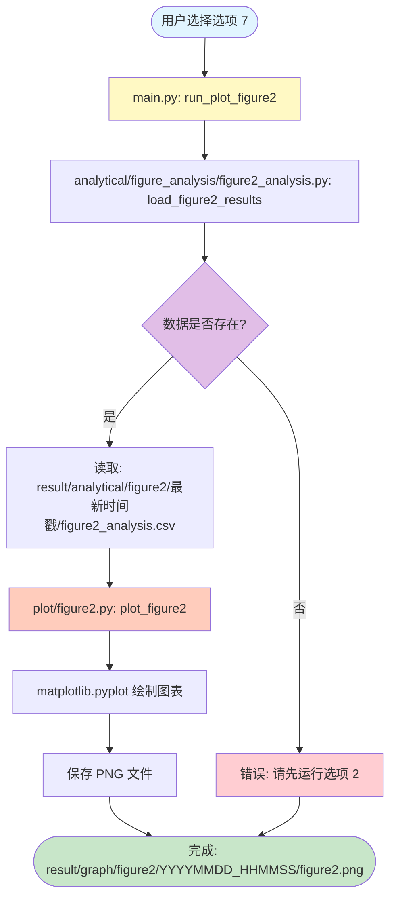

**文件调用树**:

```text
main.py
└── run_plot_figure2()
    ├── analytical/figure_analysis/figure2_analysis.py
    │   └── load_figure2_results()
    │       └── 读取: result/analytical/figure2/最新时间戳/figure2_analysis.csv
    └── plot/figure2.py
        └── plot_figure2(data, save_path, show)
            └── matplotlib.pyplot 绘制图表
            └── 保存图片到: result/graph/figure2/YYYYMMDD_HHMMSS/figure2.png
```

**调用的文件**:

- `main.py` (line 214-224)
- `analytical/figure_analysis/figure2_analysis.py` - 加载数据
- `plot/figure2.py` - 绘图逻辑

**输出文件**:

- `result/graph/figure2/YYYYMMDD_HHMMSS/figure2.png`

---

#### 选项 8: 绘制 Figure 3, 4, 5

**执行流程图**:

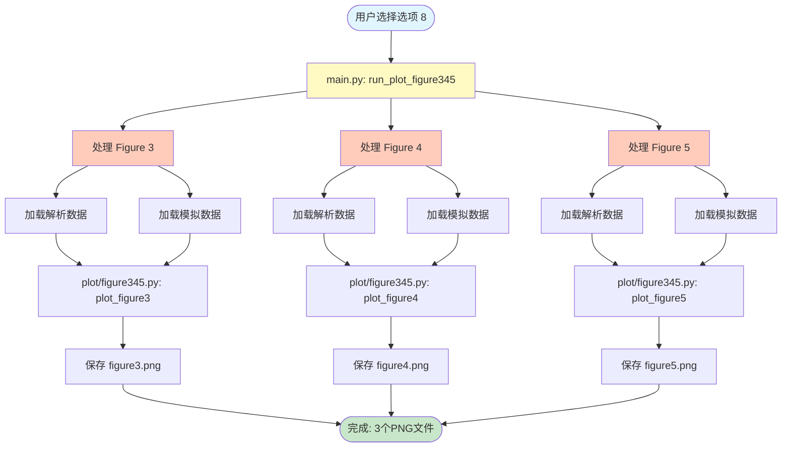

**文件调用树**:

```text
main.py
└── run_plot_figure345()
    ├── [Figure 3]
    │   ├── main._get_analytical_data_for_figure('figure3')
    │   │   └── analytical/figure_analysis/figure345_analysis.py
    │   │       └── load_figure345_results()
    │   │           └── 读取: result/analytical/figure345/最新时间戳/figure345_analysis.csv
    │   ├── main._get_simulation_data_for_figure('figure3')
    │   │   └── simulation/figure_simulation/figure345_simulation.py
    │   │       └── load_figure345_simulation_results()
    │   │           └── 读取: result/simulation/figure345/最新时间戳/figure345_simulation.csv
    │   └── plot/figure345.py
    │       └── plot_figure3(analytical_data, simulation_data, save_path, show)
    │           └── matplotlib.pyplot 绘制图表
    │           └── 保存图片到: result/graph/figure3/YYYYMMDD_HHMMSS/figure3.png
    ├── [Figure 4] 类似流程
    │   └── plot_figure4()
    │       └── 保存图片到: result/graph/figure4/YYYYMMDD_HHMMSS/figure4.png
    └── [Figure 5] 类似流程
        └── plot_figure5()
            └── 保存图片到: result/graph/figure5/YYYYMMDD_HHMMSS/figure5.png
```

**调用的文件**:

- `main.py` (line 227-260)
- `analytical/figure_analysis/figure345_analysis.py` - 加载解析数据
- `simulation/figure_simulation/figure345_simulation.py` - 加载模拟数据
- `plot/figure345.py` - 绘图逻辑

**输出文件**:

- `result/graph/figure3/YYYYMMDD_HHMMSS/figure3.png`
- `result/graph/figure4/YYYYMMDD_HHMMSS/figure4.png`
- `result/graph/figure5/YYYYMMDD_HHMMSS/figure5.png`

---

#### 选项 9: 绘制所有图表

**执行流程图**:

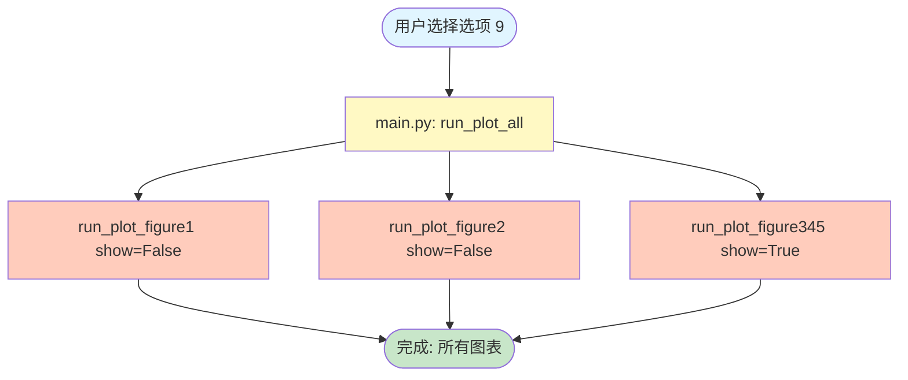

**文件调用树**:

```text
main.py
└── run_plot_all()
    ├── run_plot_figure1(show=False)  [见选项 6]
    ├── run_plot_figure2(show=False)  [见选项 7]
    └── run_plot_figure345(show=True)  [见选项 8]
```

**调用的文件**:

- `main.py` (line 263-272)
- 所有选项 6、7、8 调用的文件

**输出文件**:

- 选项 6、7、8 的所有输出文件

---

### 【完整流程】

#### 选项 10: Figure 1 完整流程 (Analytical + Plot)

**执行流程图**:


**文件调用树**:

```text
main.py
└── run_pipeline_figure1()
    ├── [1/2] run_analytical_figure1()  [见选项 1]
    └── [2/2] run_plot_figure1()  [见选项 6]
```

**调用的文件**:

- `main.py` (line 283-297)
- 选项 1 和选项 6 的所有文件

**输出文件**:

- 选项 1 和选项 6 的所有输出文件

---

#### 选项 11: Figure 2 完整流程 (Analytical + Plot)

**执行流程图**:

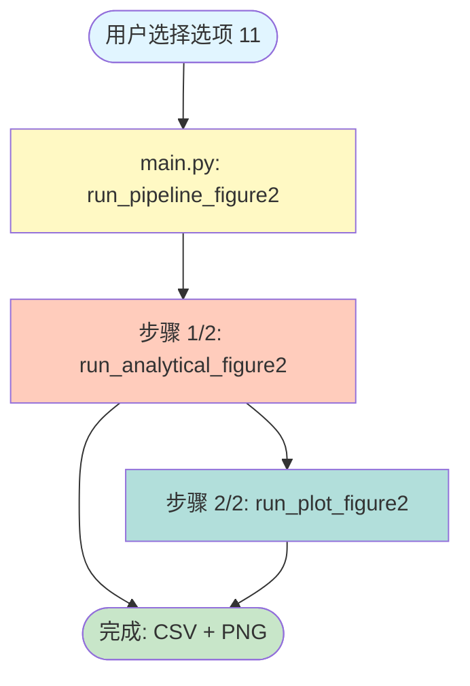

**文件调用树**:

```text
main.py
└── run_pipeline_figure2()
    ├── [1/2] run_analytical_figure2()  [见选项 2]
    └── [2/2] run_plot_figure2()  [见选项 7]
```

**调用的文件**:

- `main.py` (line 300-314)
- 选项 2 和选项 7 的所有文件

**输出文件**:

- 选项 2 和选项 7 的所有输出文件

---

#### 选项 12: Figure 3, 4, 5 完整流程 (Analytical + Simulation + Plot)

**执行流程图**:

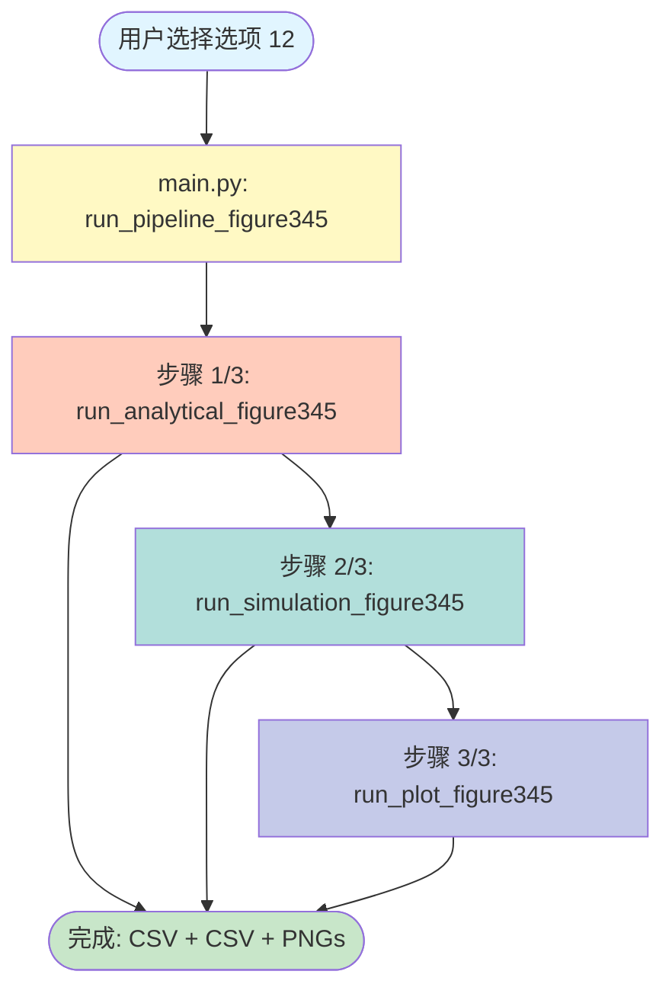

**文件调用树**:

```text
main.py
└── run_pipeline_figure345()
    ├── [1/3] run_analytical_figure345()  [见选项 3]
    ├── [2/3] run_simulation_figure345()  [见选项 5]
    └── [3/3] run_plot_figure345()  [见选项 8]
```

**调用的文件**:

- `main.py` (line 317-334)
- 选项 3、5、8 的所有文件

**输出文件**:

- 选项 3、5、8 的所有输出文件

---

#### 选项 13: 所有图表完整流程

**执行流程图**:

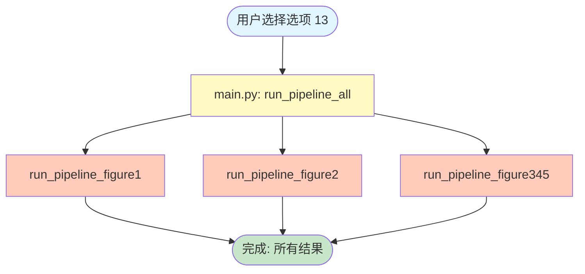

**文件调用树**:

```text
main.py
└── run_pipeline_all()
    ├── run_pipeline_figure1()  [见选项 10]
    ├── run_pipeline_figure2()  [见选项 11]
    └── run_pipeline_figure345()  [见选项 12]
```

**调用的文件**:

- `main.py` (line 337-341)
- 所有选项 10、11、12 调用的文件

**输出文件**:

- 所有选项 10、11、12 的输出文件

---

## 数据流向总结

### 解析计算流程


### 模拟流程


### 绘图流程

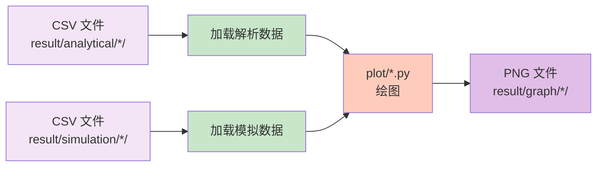

---

## 模块依赖关系图

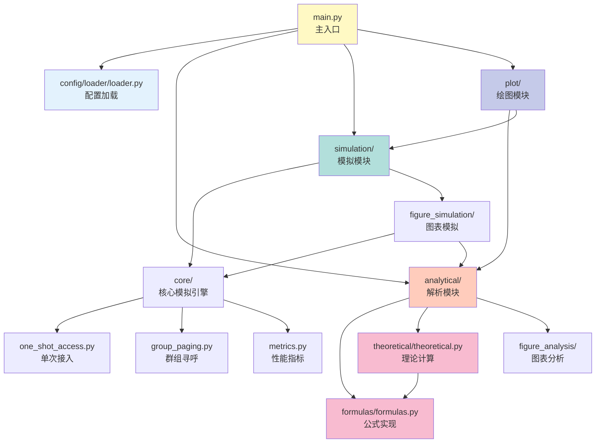

---

## 模块依赖关系

### 核心模块

- **config/loader/loader.py**: 所有选项都需要加载配置
- **analytical/formulas/formulas.py**: 提供所有数学公式实现
- **analytical/theoretical/theoretical.py**: 提供多周期理论计算

### 分析模块

- **analytical/figure_analysis/figure1_analysis.py**: Figure 1 计算
- **analytical/figure_analysis/figure2_analysis.py**: Figure 2 计算（依赖 Figure 1）
- **analytical/figure_analysis/figure345_analysis.py**: Figure 3-5 计算

### 模拟模块

- **simulation/core/one_shot_access.py**: 单次接入模拟
- **simulation/core/group_paging.py**: 群组寻呼模拟
- **simulation/core/metrics.py**: 性能指标计算
- **simulation/figure_simulation/figure345_simulation.py**: 模拟协调层

### 绘图模块

- **plot/common.py**: 共用绘图工具
- **plot/figure1.py**: Figure 1 绘图
- **plot/figure2.py**: Figure 2 绘图
- **plot/figure345.py**: Figure 3-5 绘图

---

## 注意事项

1. **Figure 2 依赖 Figure 1**: 选项 2 需要先运行选项 1，或使用选项 4 自动处理依赖
2. **Figure 3-5 模拟需要解析结果**: 选项 5 会尝试加载解析结果计算误差，如果不存在会警告但不影响模拟
3. **绘图选项需要数据**: 选项 6-9 需要先运行对应的解析或模拟选项生成数据
4. **完整流程选项**: 选项 10-13 会自动处理依赖关系，按正确顺序执行
