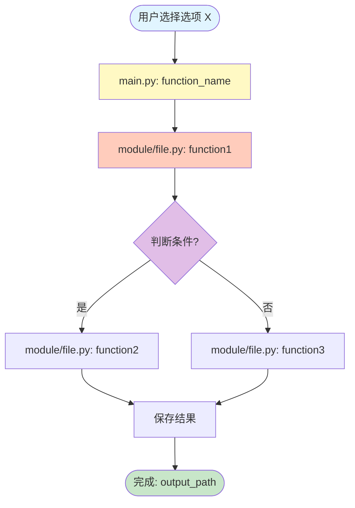
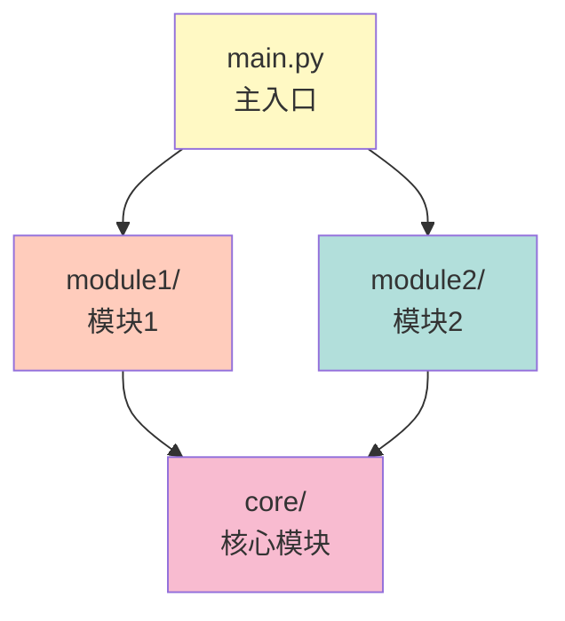

# Workflow Documentation Instruction

本文档提供创建 `workflow.md` 文件的完整指南，适用于任何项目。按照这些步骤和规则，可以为任何项目创建清晰、完整的执行流程文档。

## 目的

`workflow.md` 文档的目的是：
- **追踪执行流程**：从入口点开始，完整记录每个功能选项的执行路径
- **可视化调用关系**：使用流程图和树状图展示文件、函数之间的调用关系
- **文档化数据流**：记录数据在系统中的流动路径
- **便于理解系统**：帮助开发者快速理解系统的工作方式

---

## 创建步骤

### 步骤 1: 识别入口点

1. **找到主入口文件**
   - 通常是 `main.py`、`app.py`、`index.js` 等
   - 查找包含 `if __name__ == "__main__"` 或类似入口点的文件

2. **识别用户交互方式**
   - 交互式菜单（CLI menu）
   - 命令行参数（CLI arguments）
   - API 端点（REST/GraphQL）
   - 事件触发器（Event handlers）

3. **记录入口点信息**
   ```markdown
   ## 入口点
   
   **文件**: `main.py`
   - **函数**: `main()` → `interactive_menu()` 或 CLI 命令处理
   - **作用**: 系统主入口，提供交互式菜单和命令行接口
   ```

### 步骤 2: 识别所有功能选项

1. **列出所有用户可执行的操作**
   - 菜单选项（1, 2, 3...）
   - 命令行命令（analytical, simulation, plot...）
   - API 路由（/api/users, /api/orders...）
   - 功能模块（create, read, update, delete...）

2. **按类别分组**
   - 例如：解析计算、模拟、绘图、完整流程等
   - 或：CRUD 操作、查询操作、管理操作等

3. **为每个选项创建章节**
   ```markdown
   ### 【类别名称】
   
   #### 选项 X: 功能描述
   ```

### 步骤 3: 追踪执行流程

对于每个功能选项，需要追踪：

1. **函数调用链**
   - 从入口函数开始
   - 记录每个被调用的函数
   - 记录每个被调用的文件

2. **数据流向**
   - 输入数据来源（配置文件、数据库、API 请求等）
   - 数据处理过程
   - 输出数据位置（文件、数据库、API 响应等）

3. **依赖关系**
   - 哪些模块依赖其他模块
   - 哪些功能需要先执行其他功能

### 步骤 4: 创建可视化图表

#### 4.1 执行流程图（Mermaid Flowchart）

**规则**：
- 使用 `flowchart TD`（从上到下）
- 开始节点使用圆角矩形：`Start([用户选择选项 X])`
- 结束节点使用圆角矩形：`End([完成: 输出描述])`
- 普通步骤使用矩形：`Step[描述]`
- 决策点使用菱形：`Decision{判断条件}`
- 使用箭头表示流程：`-->`
- 决策分支使用标签：`Decision -->|是| Step1` 和 `Decision -->|否| Step2`
- 使用颜色区分不同类型的操作

**模板**：


**颜色规范**：
- 开始节点：`#e1f5ff` (浅蓝)
- 结束节点：`#c8e6c9` (浅绿)
- 主入口函数：`#fff9c4` (浅黄)
- 核心处理逻辑：`#ffccbc` (浅橙)
- 决策点：`#e1bee7` (浅紫)
- 数据操作：`#b2dfdb` (浅青)
- 其他模块：`#c5cae9` (浅蓝紫)

**注意事项**：
- 避免在节点标签中使用管道符 `|`，如需表示绝对值，使用 `abs()` 或引号包裹
- 节点标签中的特殊字符（如括号、冒号）需要用引号包裹
- 保持流程图简洁，避免过于复杂的嵌套

#### 4.2 文件调用树（Tree Diagram）

**规则**：
- 使用代码块格式，语言标记为 `text`
- 使用树状结构：`└──`、`├──`、`│`
- 显示文件路径和函数名
- 添加注释说明（用 `[注释]` 格式）
- 显示数据读取/写入操作

**模板**：
```text
main.py
└── function_name()
    ├── module1/file1.py
    │   └── function1()
    │       └── 读取: path/to/file.ext
    ├── module2/file2.py
    │   └── function2()
    │       └── 调用: module3/file3.py
    │           └── function3()
    └── 保存结果到: output/path/file.ext
```

#### 4.3 数据流向图（Data Flow Diagram）

**规则**：
- 使用 `flowchart LR`（从左到右）
- 显示数据从输入到输出的完整路径
- 使用不同颜色区分不同类型的操作

**模板**：


#### 4.4 模块依赖关系图（Dependency Graph）

**规则**：
- 使用 `graph TD`（从上到下）
- 显示模块之间的依赖关系
- 使用箭头表示依赖方向：`ModuleA --> ModuleB` 表示 A 依赖 B

**模板**：


### 步骤 5: 记录详细信息

对于每个功能选项，需要记录：

1. **调用的文件列表**
   ```markdown
   **调用的文件**:
   
   - `main.py` (line X-Y)
   - `module/file.py` - 功能描述
   - `config/file.yaml` - 配置文件
   ```

2. **输出文件/结果**
   ```markdown
   **输出文件**:
   
   - `output/path/file.ext`
   - `database/table`
   - `API response`
   ```

3. **依赖关系**
   ```markdown
   **依赖**:
   
   - 需要先运行选项 X
   - 需要配置文件 Y
   - 需要数据库连接
   ```

### 步骤 6: 创建总结部分

1. **数据流向总结**
   - 为每个主要流程创建数据流向图
   - 例如：解析流程、模拟流程、绘图流程等

2. **模块依赖关系图**
   - 展示所有模块之间的依赖关系
   - 帮助理解系统架构

3. **注意事项**
   - 记录重要的依赖关系
   - 说明执行顺序要求
   - 列出常见问题和解决方案

---

## 文档结构模板

```markdown
# Main Workflow Documentation

本文档描述从 `[入口文件]` 开始的每个[功能类型]的完整执行流程，包括所有调用的文件和模块。

## 入口点

**文件**: `[入口文件]`
- **函数**: `[入口函数]` → `[调用链]`
- **作用**: [功能描述]

---

## [功能类别 1]

### 选项/功能 1: [功能描述]

**执行流程图**:

[插入 Mermaid 流程图]

**文件调用树**:

[插入树状图]

**调用的文件**:

- [文件列表]

**输出文件**:

- [输出列表]

---

## 数据流向总结

### [流程 1]

[插入数据流向图]

### [流程 2]

[插入数据流向图]

---

## 模块依赖关系图

[插入模块依赖关系图]

---

## 注意事项

1. [注意事项 1]
2. [注意事项 2]
3. [注意事项 3]
```

---

## 规则和最佳实践

### 规则 1: 完整性
- ✅ 必须追踪从入口到输出的完整路径
- ✅ 必须记录所有被调用的文件和函数
- ✅ 必须记录所有输入和输出

### 规则 2: 准确性
- ✅ 文件路径必须准确
- ✅ 函数名必须与实际代码一致
- ✅ 行号引用必须正确（如果提供）

### 规则 3: 可视化
- ✅ 每个功能选项必须有流程图
- ✅ 每个功能选项必须有文件调用树
- ✅ 重要流程必须有数据流向图
- ✅ 必须有模块依赖关系图

### 规则 4: 可读性
- ✅ 使用清晰的中文描述
- ✅ 使用统一的格式和风格
- ✅ 使用颜色区分不同类型的操作
- ✅ 保持图表简洁，避免过于复杂

### 规则 5: 维护性
- ✅ 当代码变更时，及时更新文档
- ✅ 保持文档与代码同步
- ✅ 添加版本信息（如果需要）

---

## Mermaid 语法注意事项

### 避免的错误

1. **管道符冲突**
   - ❌ 错误：`Node[计算: |A - B|]`
   - ✅ 正确：`Node["计算: abs(A - B)"]` 或 `Node[计算: abs(A - B)]`

2. **特殊字符**
   - ❌ 错误：`Node[文件: path/to/file (read)]`
   - ✅ 正确：`Node["文件: path/to/file (read)"]`

3. **节点 ID 命名**
   - ❌ 错误：使用空格：`Node Name[Label]`
   - ✅ 正确：使用驼峰或下划线：`NodeName[Label]` 或 `Node_Name[Label]`

4. **保留关键字**
   - ❌ 错误：使用 `end`、`subgraph` 等保留字作为节点 ID
   - ✅ 正确：使用 `EndNode`、`ProcessEnd` 等

### 常用节点类型

- **圆角矩形（开始/结束）**：`([文本])`
- **矩形（普通步骤）**：`[文本]`
- **菱形（决策）**：`{文本}`
- **六边形（准备）**：`{{文本}}`
- **圆柱（数据库）**：`[(文本)]`
- **平行四边形（输入/输出）**：`[/文本/]`

---

## 检查清单

创建 workflow.md 后，请检查：

- [ ] 所有功能选项都已记录
- [ ] 每个选项都有执行流程图
- [ ] 每个选项都有文件调用树
- [ ] 所有调用的文件都已列出
- [ ] 所有输出都已记录
- [ ] 数据流向图已创建
- [ ] 模块依赖关系图已创建
- [ ] 注意事项已列出
- [ ] 所有 Mermaid 图表语法正确
- [ ] 文档格式统一
- [ ] 中文描述清晰准确

---

## 示例参考

参考 `workflow/main_workflow.md` 查看完整的示例实现。

关键示例包括：
- 选项 1：简单线性流程
- 选项 2：包含决策点的流程
- 选项 5：包含并行处理的流程
- 选项 8：包含多个子流程的流程
- 数据流向总结：三大主要流程
- 模块依赖关系图：完整的系统架构

---

## 使用说明

1. **给 AI 的提示**：
   ```
   请根据 workflow_instruction.md 的指南，为这个项目创建 workflow.md 文件。
   请先分析项目的入口点和所有功能选项，然后按照步骤创建完整的文档。
   ```

2. **手动创建**：
   - 按照步骤 1-6 逐步创建
   - 使用提供的模板
   - 参考示例文档
   - 使用检查清单验证

3. **更新维护**：
   - 当代码变更时，更新对应的流程
   - 保持文档与代码同步
   - 定期检查文档准确性

---

## 总结

创建 workflow.md 的核心是：
1. **完整追踪**：从入口到输出的完整路径
2. **可视化展示**：使用图表清晰展示流程
3. **详细记录**：记录所有文件和依赖关系
4. **易于理解**：使用清晰的中文和统一的格式

遵循这些步骤和规则，可以为任何项目创建清晰、完整、易用的 workflow 文档。

